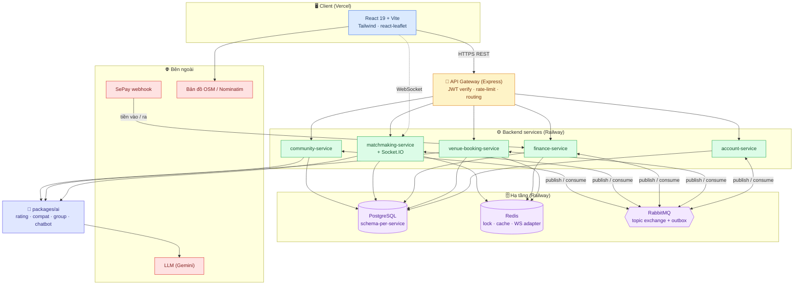
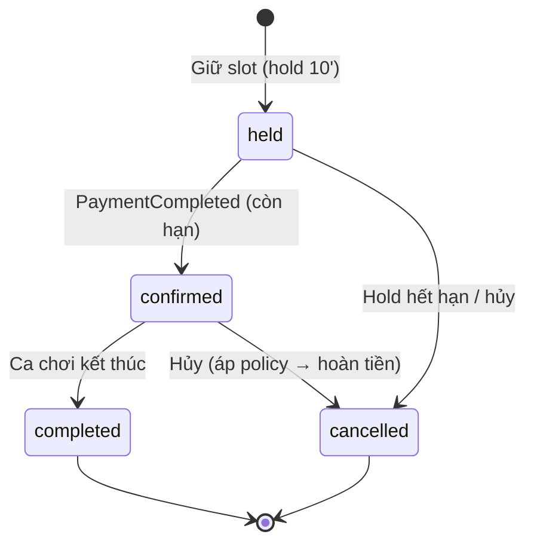
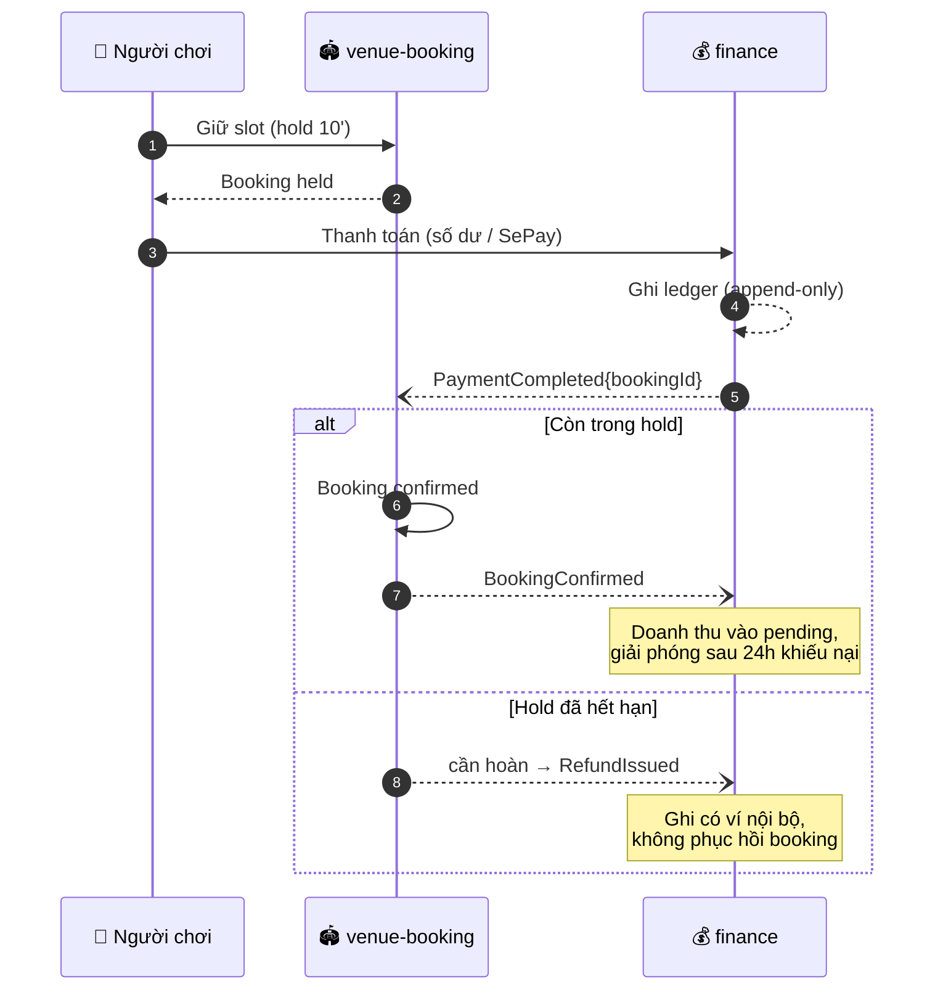
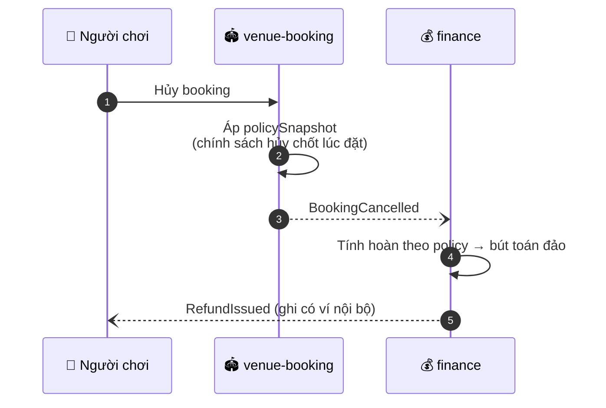
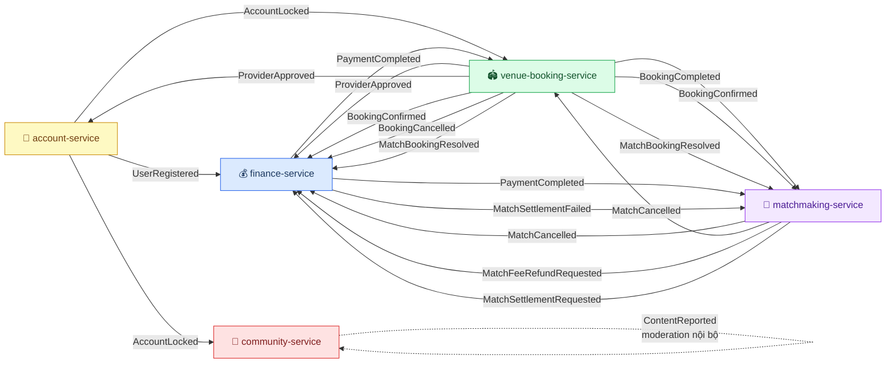
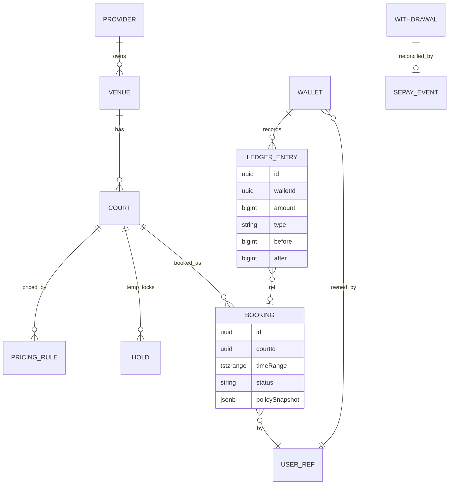

<div align="center">


# Courtin — Badminton Community Platform

**Nền tảng kết nối chủ sân, người chơi và cộng đồng cầu lông, xây dựng theo kiến trúc Microservices Event-Driven**

Đặt sân theo thời gian thực · Ví & ledger append-only · Thanh toán VietQR (SePay) · Đối soát webhook & hoàn tiền tự động · Ghép kèo live theo trình độ


</div>

---

## Mục lục

1. [Bài toán & lý do kiến trúc](#1-bài-toán--lý-do-kiến-trúc)
2. [Tính năng theo vai trò](#2-tính-năng-theo-vai-trò)
3. [Kiến trúc tổng thể](#3-kiến-trúc-tổng-thể)
4. [Công nghệ áp dụng (Tech Stack)](#4-công-nghệ-áp-dụng-tech-stack)
5. [System Design & kỹ thuật cốt lõi — giải quyết gì cho bài toán](#5-system-design--kỹ-thuật-cốt-lõi--giải-quyết-gì-cho-bài-toán)
6. [Các luồng nghiệp vụ quan trọng](#6-các-luồng-nghiệp-vụ-quan-trọng)
7. [Mô hình dữ liệu](#7-mô-hình-dữ-liệu)
8. [Cấu trúc & chạy dự án](#8-cấu-trúc--chạy-dự-án)
9. [Kỹ năng & tư duy hệ thống thể hiện qua dự án](#9-kỹ-năng--tư-duy-hệ-thống-thể-hiện-qua-dự-án)

---

## 1. Bài toán & lý do kiến trúc

Nền tảng phải giải đồng thời bốn bài toán khó, mỗi bài toán kéo theo một quyết
định kiến trúc cụ thể — không phải chọn công nghệ cho “hợp mốt” mà vì nó bắt
buộc để bài toán đúng.

| Bài toán nghiệp vụ | Rủi ro nếu làm ẩu | Quyết định kiến trúc |
|---|---|---|
| **Không được đặt trùng slot sân** | Hai người trả tiền cùng khung giờ | Chống đặt trùng ở **tầng DB**: unique constraint + lock, không tin “may rủi” tầng app |
| **Tiền tuyệt đối không sai lệch** | Mất tiền, số dư sai, không truy vết | Cô lập `finance-service` với **ledger append-only**, ranh giới audit riêng |
| **SePay không có API hoàn tiền** | Kẹt luồng hoàn/rút tiền | Hoàn tiền vào **ví nội bộ**; rút tiền đối soát bằng **webhook** |
| **Ghép kèo cần phản hồi tức thời** | Host chờ lâu, tranh chấp chỗ | **WebSocket + Redis adapter**, nhất quán khi scale ngang |

Triết lý xuyên suốt: **microservices theo domain** (mỗi service sở hữu dữ liệu
riêng, đổi một domain không phá domain khác), **mỏng nhất có thể** (chỉ thêm
thành phần khi có nhu cầu kiểm chứng được), và **nhất quán bằng saga + outbox**
thay vì distributed transaction.

---

## 2. Tính năng theo vai trò

### 👤 Người chơi
- Đăng ký/đăng nhập, xác minh email, quản lý hồ sơ và quyền riêng tư
- Tìm sân theo **danh sách + bản đồ** (react-leaflet + OpenStreetMap), xem lịch
  trống và giá, giữ slot 10 phút rồi đặt
- Ví cá nhân: nạp tiền (VietQR/SePay), thanh toán, xem lịch sử giao dịch
- Ghép kèo live theo **trình độ 5 bậc**, xin tham gia, được duyệt → trả phí →
  xác nhận chỗ; Player Passport và đánh giá hai chiều
- Tham gia cộng đồng: bài viết, bình luận, báo cáo nội dung; chatbot CSKH

### 🏟️ Chủ sân (provider)
- Quản lý nhà cung cấp, sân, giờ hoạt động, quy tắc giá và quy tắc đặt
- Xem/điều chỉnh booking phía sân, chính sách hủy
- Ví doanh nghiệp: doanh thu giữ `pending → available` sau 24h, yêu cầu rút tiền

### 🛡️ Admin
- Duyệt nhà cung cấp, khóa/khôi phục tài khoản
- Kiểm duyệt nội dung (moderation case), xử lý ticket hỗ trợ
- Đối soát rút tiền thủ công qua webhook SePay, giải quyết tranh chấp

---

## 3. Kiến trúc tổng thể

Microservices theo **domain**, một API Gateway là cửa vào HTTP duy nhất; đồng bộ
bằng REST, bất đồng bộ bằng sự kiện; realtime tách riêng qua WebSocket.



**Nguyên tắc nền:**
- **Database-per-service (logic)** — mỗi service một **schema Postgres riêng**,
  không join xuyên schema, không FK chéo service (một Postgres instance nhiều
  schema: rẻ mà vẫn giữ data ownership).
- **Auth tập trung ở biên** — `account-service` phát hành JWT, `api-gateway`
  verify; service tin JWT đã verify, chỉ lưu `userId` tham chiếu.
- **Đồng bộ cho đọc, bất đồng bộ cho lan tỏa trạng thái** — REST cho
  request-response, **RabbitMQ + outbox** cho sự kiện giữa service.
- **AI là thư viện dùng chung** (`packages/ai`), không phải service riêng.

Chi tiết đầy đủ: [docs/architecture/system-architecture.md](docs/architecture/system-architecture.md).

---

## 4. Công nghệ áp dụng (Tech Stack)

| Lớp | Công nghệ |
|---|---|
| **Frontend** | React 19 · Vite 8 · Tailwind CSS 4 · react-router-dom 7 · react-leaflet + Nominatim (OSM) · socket.io-client · oxlint · Vitest + Testing Library |
| **Backend** | Express 4 · **Prisma 5** (PostgreSQL, schema-per-service) · **Zod** · JWT · http-proxy-middleware · express-rate-limit · helmet · Vitest + Supertest |
| **Packages** | `shared` (types/DTO/event schema) · `eventbus` (RabbitMQ + outbox relay) · `object-storage` (Cloudflare R2, S3 API) · `ai` (Gemini) |
| **Hạ tầng** | PostgreSQL · Redis (lock/cache/WS adapter) · RabbitMQ (topic exchange + outbox) |
| **Nền tảng** | Monorepo npm workspaces · Node ≥ 20 · TypeScript strict · ESM |
| **Tích hợp** | **SePay** (VietQR + webhook HMAC-SHA256) · OpenStreetMap/Nominatim · Gemini (LLM) |
| **Kiểm thử** | Vitest (unit) · Supertest (API) · **Playwright** (E2E) |
| **Deploy** | Backend + PostgreSQL + Redis + RabbitMQ trên **Railway** · Frontend trên **Vercel** |

---

## 5. System Design & kỹ thuật cốt lõi — giải quyết gì cho bài toán

### 5.1. API Gateway Pattern
`api-gateway` là **cửa vào HTTP duy nhất**: verify JWT, rate-limit, CORS/helmet,
định tuyến tới service, proxy nâng cấp WebSocket. Không chứa nghiệp vụ, không DB.
→ Frontend chỉ nói chuyện với một endpoint; xác thực và giới hạn tần suất làm
một lần ở biên thay vì lặp ở từng service.

### 5.2. Event-Driven Choreography (RabbitMQ)
Service không gọi trực tiếp lẫn nhau khi lan tỏa trạng thái; chúng **publish sự
kiện** lên topic exchange (routing key `domain.event`, ví dụ `booking.confirmed`)
và service quan tâm tự consume.
→ Giảm coupling, tránh điểm chết dây chuyền: `finance` down không chặn
`venue-booking` tạo booking.

### 5.3. Outbox Pattern
Mỗi service ghi thay đổi domain **và** một dòng `outbox` trong **cùng một
transaction DB**; một relay đọc outbox rồi publish lên RabbitMQ.
→ Giải bài toán kinh điển “ghi DB xong nhưng publish thất bại” — đảm bảo **không
mất sự kiện**, không lệch dữ liệu giữa các service.

### 5.4. Kiểm soát đồng thời 2 lớp (chống đặt trùng)
- **Lớp DB**: unique constraint trên `(courtId, timeRange)` (kiểu `tstzrange`)
  cho booking `confirmed`.
- **Lớp lock**: `SELECT FOR UPDATE` / Postgres advisory lock khi giữ slot, cộng
  cơ chế `Hold` hết hạn 10 phút (job nền quét).
→ Xung đột đặt sân bị chặn ngay cả khi hai request đến cùng lúc.

### 5.5. Idempotency
Mỗi consumer lưu `processedEventId` để bỏ qua sự kiện trùng; ledger là
append-only nên xử lý lại một sự kiện không nhân đôi bút toán.
→ An toàn với “at-least-once delivery” của message queue và webhook lặp.

### 5.6. Tích hợp SePay & phân loại webhook
SePay không có API hoàn tiền, nên hệ thống tự khép vòng đời tiền:
- **Nạp** = webhook “tiền vào” → ghi có ví.
- **Hoàn tiền** = ghi có ví nội bộ (tự động, bút toán đảo).
- **Rút** = admin chuyển khoản tay → webhook “tiền ra” tự khớp
  `WithdrawalRequest` → `paid`.

Webhook xác thực **HMAC-SHA256**, phân loại theo hướng tiền vào/ra rồi khớp
tham chiếu.
→ Vòng đời tiền hoàn chỉnh dù cổng thanh toán không hỗ trợ refund.

### 5.7. Redis đa vai trò
Một Redis phục vụ ba việc: **distributed lock** (giữ slot), **cache** (dữ liệu
đọc nhiều), và **Socket.IO adapter** (chia room across instance cho realtime).
→ Tận dụng một thành phần hạ tầng cho nhiều nhu cầu, giữ hệ thống mỏng.

### 5.8. State Machine tường minh
Trạng thái được mô hình hóa rõ ràng thay vì cờ boolean rải rác. Ví dụ vòng đời
một booking:



Tương tự: `WithdrawalRequest: pending → paid`;
`WaitlistEntry: pending → approved → confirmed → withdrawn`.
→ Chuyển trạng thái hợp lệ được kiểm soát, dễ suy luận và test.

---

## 6. Các luồng nghiệp vụ quan trọng

### 6.1. Đặt sân → Thanh toán thành công (saga)



### 6.2. Hủy sân → Hoàn tiền



> Thanh toán đến muộn thì ghi có ví, **không** phục hồi booking đã hết hạn — quy
> tắc rõ ràng tránh trạng thái mập mờ.

Luồng ghép kèo live và đối soát rút tiền: xem
[system-architecture.md §8](docs/architecture/system-architecture.md).

### 6.3. Danh mục sự kiện liên service (event flow)

Tất cả sự kiện đi qua một **topic exchange `domain-events`** trên RabbitMQ,
routing key chính là `eventType`; consumer `bindQueue` theo từng loại. Sơ đồ
dưới lấy đúng producer → consumer đang được wiring trong code (`outbox` bên phát,
`bindQueue` bên nhận):



| Sự kiện | Producer | Consumer | Ý nghĩa |
|---|---|---|---|
| `UserRegistered` | account | finance | Khởi tạo ví cá nhân |
| `ProviderApproved` | venue-booking | finance, account | Tạo ví doanh nghiệp + cấp vai trò provider |
| `AccountLocked` | account | venue-booking, community | Khóa hành động, ẩn sân khỏi tìm kiếm |
| `BookingConfirmed` | venue-booking | finance, matchmaking | Giữ tiền 24h; kèo gắn booking được kích hoạt |
| `BookingCancelled` | venue-booking | finance | Hoàn tiền theo policy |
| `BookingCompleted` | venue-booking | matchmaking | Mở đánh giá kèo |
| `PaymentCompleted` | finance | venue-booking, matchmaking | Xác nhận booking / xác nhận chỗ kèo |
| `MatchCancelled` | matchmaking | finance, venue-booking | Hoàn phí, nhả booking gắn kèo |
| `MatchFeeRefundRequested` / `MatchSettlementRequested` | matchmaking / finance | finance | Vòng đối soát phí tham gia kèo |
| `ContentReported` | community | community | Tạo moderation case nội bộ |

> **Độ tin cậy**: mỗi cạnh trong sơ đồ được bảo vệ bởi **outbox** (bên phát, ghi
> cùng transaction) và **idempotent consumer** (`processedEventId`, bên nhận) —
> sự kiện không mất và không xử lý trùng.

---

## 7. Mô hình dữ liệu

Mỗi service sở hữu schema riêng; tham chiếu người dùng bằng `userId`, **không FK
chéo schema**. ERD hai service quan hệ nhất (venue-booking + finance):



Điểm thiết kế đáng chú ý:
- **`LedgerEntry` append-only** với `before`/`after` — số dư luôn tái dựng được
  từ lịch sử, mọi biến động tiền có dấu vết audit.
- **`timeRange` kiểu `tstzrange`** — cho phép ràng buộc chống chồng lấn ở tầng DB.
- **`policySnapshot` (jsonb)** — chính sách hủy được “đóng băng” lúc đặt, không
  bị thay đổi hồi tố khi provider sửa chính sách sau này.
- **Ảnh/venue** lưu `objectKey` thô; route public map `objectKey → read URL`,
  route managed giữ objectKey để round-trip.

Chi tiết: [docs/architecture/data-model.md](docs/architecture/data-model.md).

---

## 8. Cấu trúc & chạy dự án

```text
apps/
  web/                     React 19 + Vite + Tailwind (Vercel)
services/
  api-gateway/             Cửa vào HTTP: JWT verify · rate-limit · routing
  account-service/         Tài khoản, phân quyền, JWT
  venue-booking-service/   Sân, lịch, tìm kiếm, booking + chống đặt trùng
  finance-service/         Ví, ledger, SePay, rút tiền, tranh chấp
  matchmaking-service/     Ghép kèo, Passport, WebSocket
  community-service/       Bài viết, kiểm duyệt, hỗ trợ, chatbot
packages/
  shared/                  Types/DTO/event schema dùng chung
  eventbus/                RabbitMQ + outbox relay
  object-storage/          Cloudflare R2 (S3 API)
  ai/                      Rating · compat · group · LLM (Gemini)
infra/                     docker compose (PostgreSQL · Redis · RabbitMQ)
docs/                      Sản phẩm · kiến trúc · quyết định · kế hoạch
e2e/                       Playwright
```

Mỗi service: `src/{routes,controllers,domain,repo,events}` +
`prisma/schema.prisma` (schema riêng).

**Chạy cục bộ:**

```bash
npm install
npm run infra:up        # PostgreSQL + Redis + RabbitMQ qua docker compose
npm run dev             # chạy song song 6 service (concurrently)
```

**Kiểm chứng trước khi commit:**

```bash
npm run build           # tsc -b toàn workspace — bắt buộc chạy ở root
npm run test -w services/finance-service   # test tập trung workspace vừa sửa
npm run e2e             # Playwright, cần .env ở root
```

Env: một `.env` ở root (service load qua `dotenv -e ../../.env`); mẫu ở
[.env.example](.env.example). Lỗi type ở `apps/web` làm **fail cả deploy backend
trên Railway** — luôn chạy root build trước khi commit.

---

## 9. Kỹ năng & tư duy hệ thống thể hiện qua dự án

**Thiết kế hệ thống phân tán**
- Phân rã theo **bounded context** (domain), data ownership rõ ràng, không chia
  sẻ entity/business logic xuyên service — chỉ chia sẻ contract/DTO/event schema.
- **Choreography** thay vì orchestration tập trung, giảm coupling.
- Nhất quán cuối bằng **saga + outbox**, bù trừ khi lỗi thay vì distributed
  transaction.

**Độ tin cậy & an toàn dữ liệu**
- **Outbox + idempotent consumer** cho message không mất, không nhân đôi.
- **Ledger append-only** và audit trail cho miền tài chính — bảo toàn giá trị,
  truy vết được.
- Kiểm soát đồng thời **2 lớp** (DB constraint + lock) cho tài nguyên tranh chấp.

**Kỹ thuật realtime & tích hợp ngoài**
- WebSocket (Socket.IO) + **Redis adapter** để scale ngang realtime.
- Tích hợp cổng thanh toán không hoàn hảo (**SePay không có refund API**) bằng
  đối soát webhook + ví nội bộ — tư duy “thiết kế quanh ràng buộc thực tế”.

**Kỹ thuật frontend**
- React 19 + Tailwind 4, bản đồ tương tác (react-leaflet + OSM) thay nhập tọa độ
  thủ công, TypeScript strict end-to-end.

**Kỷ luật kỹ thuật**
- Monorepo TypeScript strict, ESM; **spec-first** (user story + AC trước code).
- Kiểm thử nhiều tầng: unit (Vitest) · API (Supertest) · **E2E (Playwright)**.
- Định nghĩa hoàn thành rõ ràng: test pass → root build pass → E2E khi chạm luồng
  chính, có bằng chứng bằng output lệnh chứ không tự nhận “đã xong”.

---

<div align="center">

📚 Tài liệu: [WORKFLOW](docs/WORKFLOW.md) ·
[Phân kỳ](docs/product/phasing.md) ·
[Kiến trúc](docs/architecture/system-architecture.md) ·
[Data model](docs/architecture/data-model.md) ·
[Quyết định](docs/product/decision-log.md)

</div>
