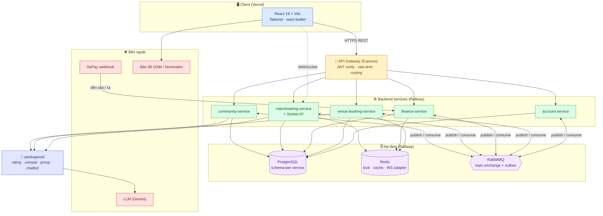
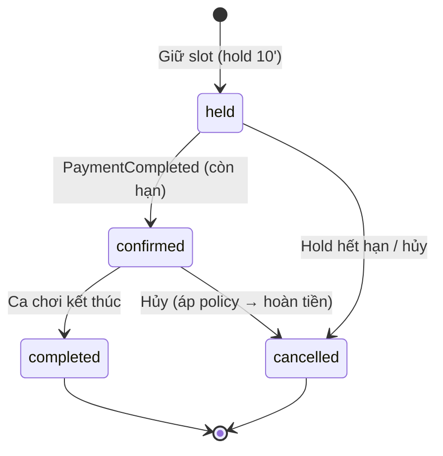
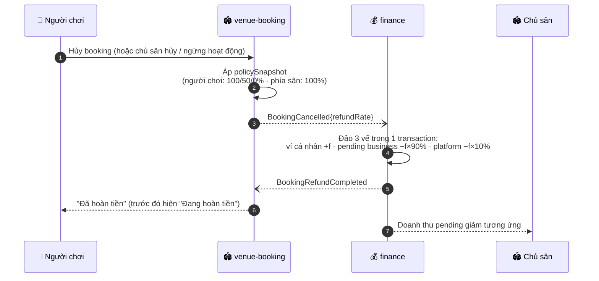
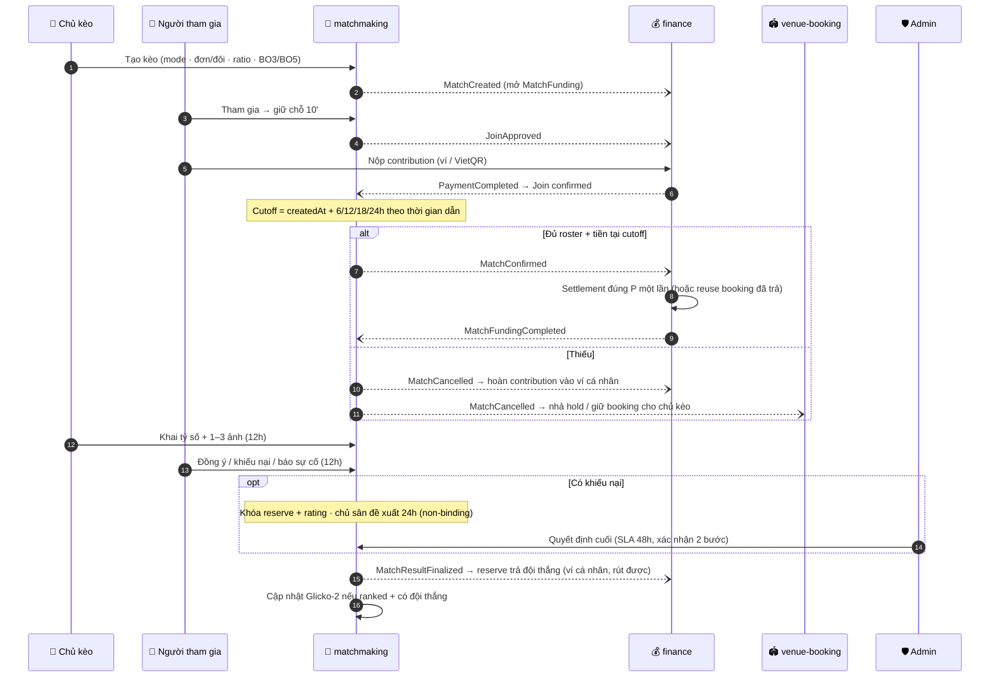
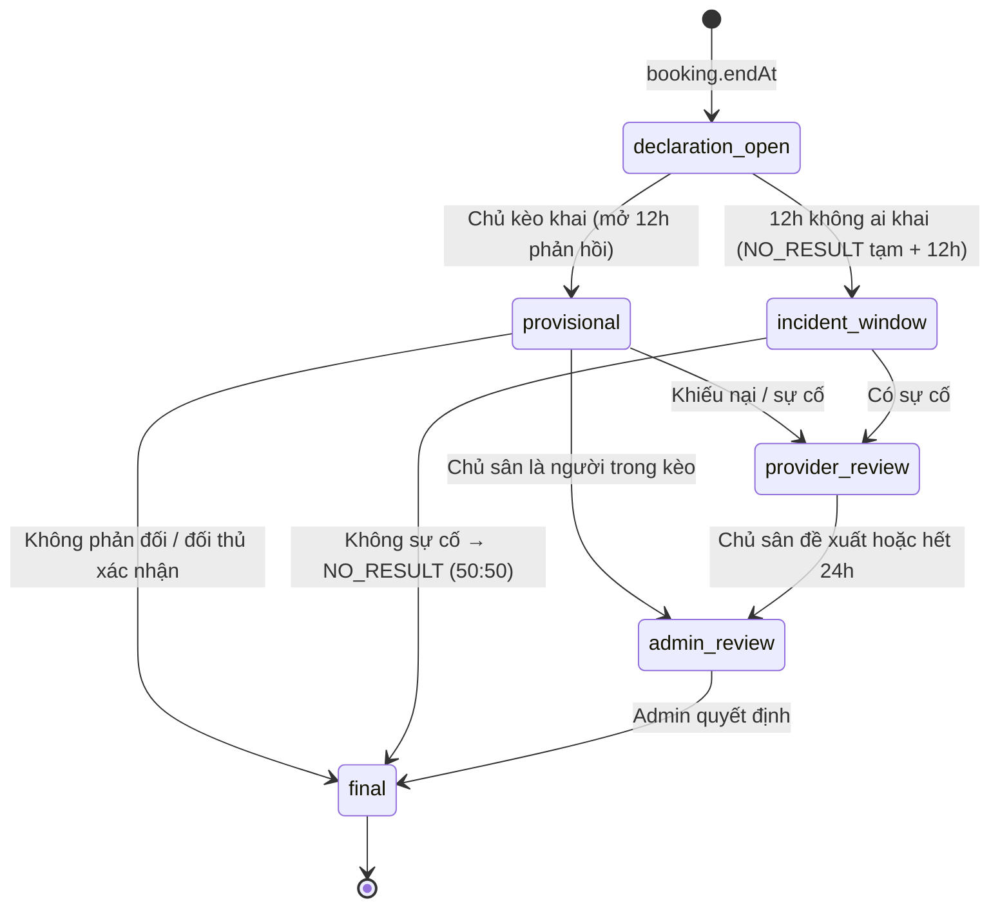
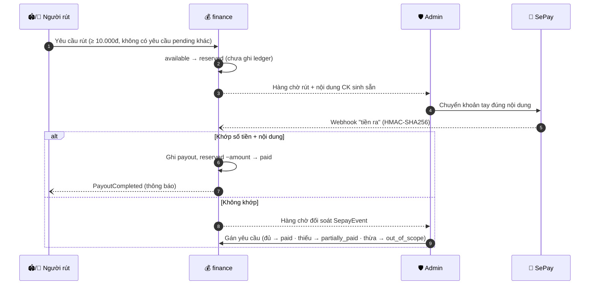
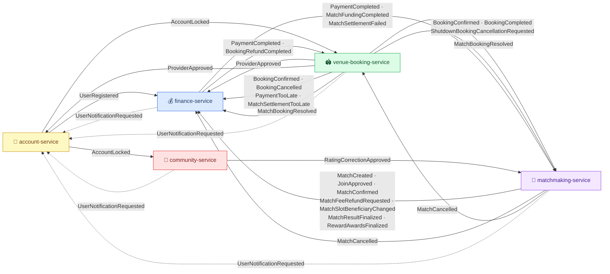
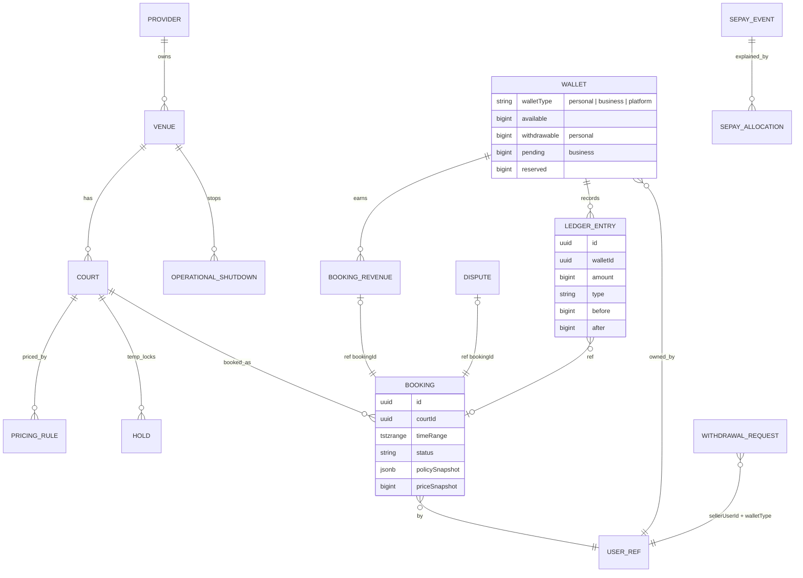
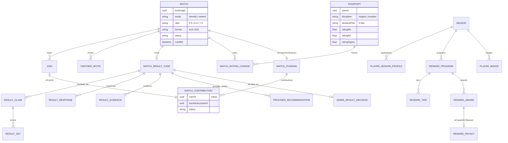

<div align="center">


# Courtin — Badminton Community Platform

**Nền tảng kết nối chủ sân, người chơi và cộng đồng cầu lông, xây dựng theo kiến trúc Microservices Event-Driven**

Đặt sân theo thời gian thực · Ví & ledger append-only · Thanh toán VietQR (SePay) · Đối soát webhook & hoàn tiền tự động · Ghép kèo live theo trình độ


</div>

---

## Mục lục

0. [Bắt đầu nhanh](#0-bắt-đầu-nhanh)
   - 0.1. [Quy trình nghiệp vụ](#01-quy-trình-nghiệp-vụ)
   - 0.2. [Hướng dẫn chạy dự án](#02-hướng-dẫn-chạy-dự-án)
   - 0.3. [Performance Benchmarks](#03-performance-benchmarks)
1. [Bài toán & lý do kiến trúc](#1-bài-toán--lý-do-kiến-trúc)
2. [Tính năng theo vai trò](#2-tính-năng-theo-vai-trò)
3. [Kiến trúc tổng thể](#3-kiến-trúc-tổng-thể)
4. [Công nghệ áp dụng (Tech Stack)](#4-công-nghệ-áp-dụng-tech-stack)
5. [System Design & kỹ thuật cốt lõi — giải quyết gì cho bài toán](#5-system-design--kỹ-thuật-cốt-lõi--giải-quyết-gì-cho-bài-toán)
6. [Các luồng nghiệp vụ quan trọng](#6-các-luồng-nghiệp-vụ-quan-trọng)
7. [Mô hình dữ liệu](#7-mô-hình-dữ-liệu)
8. [Cấu trúc dự án](#8-cấu-trúc-dự-án)
9. [Kỹ năng & tư duy hệ thống thể hiện qua dự án](#9-kỹ-năng--tư-duy-hệ-thống-thể-hiện-qua-dự-án)

---

## 0. Bắt đầu nhanh

### 0.1. Quy trình nghiệp vụ

Tóm tắt **ai làm gì – hệ thống xử lý ra sao – ai tiếp nhận** cho 11 chuỗi
nghiệp vụ chính (đặt sân, hủy & hoàn tiền, tranh chấp, doanh thu chủ sân, rút
tiền, đối soát SePay, kèo & ký quỹ, duyệt chủ sân, điểm xếp hạng & thưởng,
cộng đồng & hỗ trợ), kèm bản đồ liên kết giữa Người chơi · Chủ sân · Admin:

📄 [docs/product/tom-tat-luong-nghiep-vu.md](docs/product/tom-tat-luong-nghiep-vu.md)

### 0.2. Hướng dẫn chạy dự án

Yêu cầu: **Node ≥ 20**, **Docker** (cho PostgreSQL 16 · Redis 7 · RabbitMQ 3.13 · MinIO).

```bash
cp .env.example .env          # điền JWT_SECRET, INTERNAL_SERVICE_TOKEN, SePay/Gemini/email nếu cần
npm install                   # postinstall tự prisma generate
npm run infra:up              # docker compose: Postgres · Redis · RabbitMQ · MinIO
npm run prisma:migrate        # áp migration cho từng schema service
npm run dev                   # gateway + 5 service (watch)
npm run dev -w apps/web       # frontend (terminal khác)
```

| Thành phần | Cổng |
|---|---|
| Frontend (Vite) | `5173` |
| API Gateway | `3000` |
| account · venue-booking · finance · matchmaking · community | `3001` · `3002` · `3003` · `3004` · `3005` |
| PostgreSQL · Redis · RabbitMQ · MinIO | `5432` · `6379` · `5672` · `9000` |

Kiểm tra: `npm run build` (type-check toàn workspace) · `npm test -w <workspace>`
(Vitest) · `npm run e2e` (Playwright, cần `.env` và stack đang chạy).
Dừng hạ tầng: `npm run infra:down`.

### 0.3. Performance Benchmarks

Số đo thực hiện trên máy local — **12th Gen Intel Core i7-12700H**, Windows 11,
Node 22.18, PostgreSQL 16, ngày 2026-08-20–2026-08-21.

#### Performance / speed

| Chỉ số | Kết quả | Điều kiện đo |
|---|---:|---|
| API gateway `/health` — p50 | **58 ms** | 3.000 request, concurrency 50 |
| API gateway `/health` — p95 | **196 ms** | 3.000 request, concurrency 50 |
| API gateway `/health` — throughput | **635 req/s** | 3.000 request, concurrency 50 |
| Frontend bundle transfer | **800,64 KB → 245,73 KB gzip (−69,3%)** | production build local |
| Frontend build time | **1,57 s** | Vite production build local |

Bằng chứng: [docs/benchmarks/bench.mjs](docs/benchmarks/bench.mjs) ·
[docs/benchmarks/cv-metrics-2026-08-20_Courtin.md](docs/benchmarks/cv-metrics-2026-08-20_Courtin.md).

#### Scale / load (realtime)

| Chỉ số | Kết quả | Điều kiện đo |
|---|---:|---|
| Socket.IO concurrent connections | **500** | 500 client local, một lượt tải |
| WebSocket warm RTT — p50 | **1,1 ms** | 200 mẫu RTT |

Bằng chứng: [docs/benchmarks/ws-bench.mjs](docs/benchmarks/ws-bench.mjs).

#### Data access — call reduction

| Chỉ số | Kết quả | Điều kiện đo |
|---|---:|---|
| Prisma relational filtering | **450 → 1 DB query (−99,8%)** | 50 venue, 200 court |
| Batch match-context API | **101 → 1 internal HTTP call (−99,0%)** | 101 match |

Bằng chứng:
[docs/benchmarks/new-performance-bench.ts](docs/benchmarks/new-performance-bench.ts) ·
[docs/benchmarks/cv-performance-improvements-2026-08-20.md](docs/benchmarks/cv-performance-improvements-2026-08-20.md).

#### Security / compliance

| Chỉ số | Kết quả | Điều kiện đo |
|---|---:|---|
| HMAC-SHA256 webhook verification | **15.000 check** (5.000 hợp lệ / 5.000 giả mạo / 5.000 sửa đổi) | gọi trực tiếp `verifySepaySignature` |

Bằng chứng: [docs/benchmarks/load.mjs](docs/benchmarks/load.mjs) ·
[docs/benchmarks/cv-metrics-2026-08-20_Courtin.md](docs/benchmarks/cv-metrics-2026-08-20_Courtin.md).

#### Availability (local health sampling)

| Chỉ số | Kết quả | Điều kiện đo |
|---|---:|---|
| Health probe qua gateway | **600/600 thành công** | 100 vòng × 6 endpoint local |

#### Code quality / testing

| Chỉ số | Kết quả | Phạm vi |
|---|---:|---|
| Test thực thi pass | **298 test** | Venue Booking 117 · Finance 95 · Matchmaking 77 · Object Storage 9 |
| Test inventory tĩnh | **486 test case / 108 file**, cộng **11 E2E** | toàn repo (chưa chứng minh pass rate) |

#### Automation / productivity

| Chỉ số | Kết quả | Điều kiện đo |
|---|---:|---|
| Capability audit | **157 surface** (126 HTTP · 8 Socket.IO · 23 event) | `ui:coverage` |
| Missing UI mapping phát hiện | **4/157 (2,5%)** | cùng lần audit |

> **Giới hạn:** không có số production uptime/MTTR/SLO; các phần trăm là tỷ lệ
> call bị loại bỏ hoặc tỷ lệ payload nén, không phải claim latency giảm tương
> ứng. Chi tiết mẫu đo và ràng buộc: [docs/benchmarks/](docs/benchmarks/).

---

## 1. Bài toán & lý do kiến trúc

Nền tảng phải giải đồng thời bốn bài toán khó, mỗi bài toán kéo theo một quyết
định kiến trúc cụ thể — không phải chọn công nghệ cho “hợp mốt” mà vì nó bắt
buộc để bài toán đúng.

| Bài toán nghiệp vụ | Rủi ro nếu làm ẩu | Quyết định kiến trúc |
|---|---|---|
| **Không được đặt trùng slot sân** | Hai người trả tiền cùng khung giờ | Chống đặt trùng ở **tầng DB**: unique constraint + lock, không tin “may rủi” tầng app |
| **Tiền tuyệt đối không sai lệch** | Mất tiền, số dư sai, không truy vết | Cô lập `finance-service` với **ledger append-only**, ranh giới audit riêng |
| **SePay không có API hoàn tiền** | Kẹt luồng hoàn/rút tiền | Hoàn tiền vào **ví nội bộ**; rút tiền đối soát bằng **webhook** |
| **Ghép kèo cần phản hồi tức thời** | Host chờ lâu, tranh chấp chỗ | **WebSocket + Redis adapter**, nhất quán khi scale ngang |

Triết lý xuyên suốt: **microservices theo domain** (mỗi service sở hữu dữ liệu
riêng, đổi một domain không phá domain khác), **mỏng nhất có thể** (chỉ thêm
thành phần khi có nhu cầu kiểm chứng được), và **nhất quán bằng saga + outbox**
thay vì distributed transaction.

---

## 2. Tính năng theo vai trò

### 👤 Người chơi
- Đăng ký/đăng nhập, xác minh email, quản lý hồ sơ và quyền riêng tư
- Tìm sân theo **danh sách + bản đồ** (react-leaflet + OpenStreetMap), xem lịch
  trống, giá và **bản đồ nhiệt giờ đông/vắng**; giữ slot 10 phút rồi thanh toán
- Hủy sân theo chính sách chốt lúc đặt (≥24h 100% · 6–24h 50% · <6h 0%),
  tiền hoàn về ví; gửi **tranh chấp giao dịch** trong 24h sau ca
- Ví cá nhân: nạp (VietQR/SePay), thanh toán, lịch sử; **rút phần tiền hoàn /
  tiền thắng kèo** (tiền nạp chủ động không rút)
- **Kèo giao lưu / xếp hạng**, đơn hoặc đôi, ký quỹ theo tỷ lệ **5:5 · 6:4 · 7:3**;
  giữ chỗ 10 phút, mời đồng đội đích danh (tự trả hoặc chủ kèo trả thay), hạn
  chốt theo thời gian dẫn; gợi ý kèo bằng AI có giải thích
- **Khai kết quả** (chủ kèo nhập tỷ số + ảnh), xác nhận / khiếu nại / báo sự cố;
  điểm xếp hạng **Glicko-2** đơn/đôi trên thang **5 bậc**, BXH theo kỳ, huy hiệu,
  nhận thưởng chương trình
- Cộng đồng: bài viết, bình luận, báo cáo nội dung; ticket hỗ trợ có ảnh;
  bong bóng chat CSKH (AI)

### 🏟️ Chủ sân (provider)
- Quản lý cơ sở, sân con (1–5 ảnh), giờ hoạt động, ngày nghỉ, biểu giá theo
  khung giờ, quy tắc đặt; lịch sân hợp nhất và booking tại quầy
- Đổi sân con / hủy booking phía sân (hoàn 100%); **ngừng hoạt động** 3 chế độ
  (ngừng dần · đóng từ ngày · khẩn cấp) với hủy + hoàn tự động
- Ví kinh doanh: doanh thu `pending → available` sau 24h không tranh chấp,
  báo cáo doanh thu, gợi ý khung giờ ế, yêu cầu rút tiền
- Đề xuất (không ràng buộc) kết quả kèo bị khiếu nại tại sân mình

### 🛡️ Admin
- Duyệt nhà cung cấp, khóa (ngắt phiên ngay) / khôi phục tài khoản
- Hàng chờ rút tiền, **đối soát giao dịch SePay chưa khớp**, giải quyết tranh chấp
  giao dịch
- Quyết định cuối kết quả kèo tranh chấp (SLA 48h, xác nhận 2 bước)
- Quản lý kỳ xếp hạng, chương trình thưởng và chi thưởng
- Kiểm duyệt nội dung, xử lý ticket hỗ trợ (kể cả điều chỉnh trình độ)

---

## 3. Kiến trúc tổng thể

Microservices theo **domain**, một API Gateway là cửa vào HTTP duy nhất; đồng bộ
bằng REST, bất đồng bộ bằng sự kiện; realtime tách riêng qua WebSocket.


```mermaid
graph TB
    subgraph Client["🖥️ Client (Vercel)"]
        FE["React 19 + Vite<br/>Tailwind · react-leaflet"]
    end

    GW["🚪 API Gateway (Express)<br/>JWT verify · rate-limit · routing"]

    subgraph Services["⚙️ Backend services (Railway)"]
        ACC["account-service"]
        VB["venue-booking-service"]
        FIN["finance-service"]
        MM["matchmaking-service<br/>+ Socket.IO"]
        COM["community-service"]
    end

    AILIB["🧠 packages/ai<br/>rating · compat · group · chatbot"]

    subgraph Infra["🗄️ Hạ tầng (Railway)"]
        PG[("PostgreSQL<br/>schema-per-service")]
        REDIS[("Redis<br/>lock · cache · WS adapter")]
        MQ{{"RabbitMQ<br/>topic exchange + outbox"}}
    end

    subgraph External["🌐 Bên ngoài"]
        SEPAY["SePay webhook"]
        MAPS["Bản đồ OSM / Nominatim"]
        LLM["LLM (Gemini)"]
    end

    FE -->|HTTPS REST| GW
    FE -.->|WebSocket| MM
    GW --> ACC & VB & FIN & MM & COM

    ACC & VB & FIN & MM & COM --> PG
    VB & FIN & MM --> REDIS
    ACC & VB & FIN & MM & COM <-->|publish / consume| MQ

    MM & COM & VB --> AILIB
    AILIB --> LLM
    SEPAY -->|tiền vào / ra| FIN
    FE --> MAPS

    classDef client fill:#dbeafe,stroke:#2563eb,color:#1e3a5f;
    classDef gw fill:#fef3c7,stroke:#d97706,color:#78350f;
    classDef svc fill:#dcfce7,stroke:#16a34a,color:#14532d;
    classDef infra fill:#f3e8ff,stroke:#9333ea,color:#4c1d95;
    classDef ext fill:#fee2e2,stroke:#dc2626,color:#7f1d1d;
    classDef ai fill:#e0e7ff,stroke:#4f46e5,color:#312e81;
    class FE client;
    class GW gw;
    class ACC,VB,FIN,MM,COM svc;
    class PG,REDIS,MQ infra;
    class SEPAY,MAPS,LLM ext;
    class AILIB ai;
```

**Nguyên tắc nền:**
- **Database-per-service (logic)** — mỗi service một **schema Postgres riêng**,
  không join xuyên schema, không FK chéo service (một Postgres instance nhiều
  schema: rẻ mà vẫn giữ data ownership).
- **Auth tập trung ở biên** — `account-service` phát hành JWT, `api-gateway`
  verify; service tin JWT đã verify, chỉ lưu `userId` tham chiếu.
- **Đồng bộ cho đọc, bất đồng bộ cho lan tỏa trạng thái** — REST cho
  request-response, **RabbitMQ + outbox** cho sự kiện giữa service.
- **AI là thư viện dùng chung** (`packages/ai`), không phải service riêng.

Chi tiết đầy đủ: [docs/architecture/system-architecture.md](docs/architecture/system-architecture.md).

---

## 4. Công nghệ áp dụng (Tech Stack)

| Lớp | Công nghệ |
|---|---|
| **Frontend** | React 19 · Vite 8 · Tailwind CSS 4 · react-router-dom 7 · react-leaflet + Nominatim (OSM) · socket.io-client · oxlint · Vitest + Testing Library |
| **Backend** | Express 4 · **Prisma 5** (PostgreSQL, schema-per-service) · **Zod** · JWT · http-proxy-middleware · express-rate-limit · helmet · Vitest + Supertest |
| **Packages** | `shared` (types/DTO/event schema) · `eventbus` (RabbitMQ + outbox relay) · `object-storage` (Cloudflare R2, S3 API) · `ai` (Gemini) |
| **Hạ tầng** | PostgreSQL · Redis (lock/cache/WS adapter) · RabbitMQ (topic exchange + outbox) |
| **Nền tảng** | Monorepo npm workspaces · Node ≥ 20 · TypeScript strict · ESM |
| **Tích hợp** | **SePay** (VietQR + webhook HMAC-SHA256) · OpenStreetMap/Nominatim · Gemini (LLM) |
| **Kiểm thử** | Vitest (unit) · Supertest (API) · **Playwright** (E2E) |
| **Deploy** | Backend + PostgreSQL + Redis + RabbitMQ trên **Railway** · Frontend trên **Vercel** |

---

## 5. System Design & kỹ thuật cốt lõi — giải quyết gì cho bài toán

### 5.1. API Gateway Pattern
`api-gateway` là **cửa vào HTTP duy nhất**: verify JWT, rate-limit, CORS/helmet,
định tuyến tới service, proxy nâng cấp WebSocket. Không chứa nghiệp vụ, không DB.
→ Frontend chỉ nói chuyện với một endpoint; xác thực và giới hạn tần suất làm
một lần ở biên thay vì lặp ở từng service.

### 5.2. Event-Driven Choreography (RabbitMQ)
Service không gọi trực tiếp lẫn nhau khi lan tỏa trạng thái; chúng **publish sự
kiện** lên topic exchange (routing key `domain.event`, ví dụ `booking.confirmed`)
và service quan tâm tự consume.
→ Giảm coupling, tránh điểm chết dây chuyền: `finance` down không chặn
`venue-booking` tạo booking.

### 5.3. Outbox Pattern
Mỗi service ghi thay đổi domain **và** một dòng `outbox` trong **cùng một
transaction DB**; một relay đọc outbox rồi publish lên RabbitMQ.
→ Giải bài toán kinh điển “ghi DB xong nhưng publish thất bại” — đảm bảo **không
mất sự kiện**, không lệch dữ liệu giữa các service.

### 5.4. Kiểm soát đồng thời 2 lớp (chống đặt trùng)
- **Lớp DB**: unique constraint trên `(courtId, timeRange)` (kiểu `tstzrange`)
  cho booking `confirmed`.
- **Lớp lock**: `SELECT FOR UPDATE` / Postgres advisory lock khi giữ slot, cộng
  cơ chế `Hold` hết hạn 10 phút (job nền quét).
→ Xung đột đặt sân bị chặn ngay cả khi hai request đến cùng lúc.

### 5.5. Idempotency
Mỗi consumer lưu `processedEventId` để bỏ qua sự kiện trùng; ledger là
append-only nên xử lý lại một sự kiện không nhân đôi bút toán.
→ An toàn với “at-least-once delivery” của message queue và webhook lặp.

### 5.6. Tích hợp SePay & phân loại webhook
SePay không có API hoàn tiền, nên hệ thống tự khép vòng đời tiền:
- **Nạp** = webhook “tiền vào” → ghi có ví.
- **Hoàn tiền** = ghi có ví nội bộ (tự động, bút toán đảo).
- **Rút** = admin chuyển khoản tay → webhook “tiền ra” tự khớp
  `WithdrawalRequest` → `paid`.

Webhook xác thực **HMAC-SHA256**, phân loại theo hướng tiền vào/ra rồi khớp
tham chiếu.
→ Vòng đời tiền hoàn chỉnh dù cổng thanh toán không hỗ trợ refund.

### 5.7. Redis đa vai trò
Một Redis phục vụ ba việc: **distributed lock** (giữ slot), **cache** (dữ liệu
đọc nhiều), và **Socket.IO adapter** (chia room across instance cho realtime).
→ Tận dụng một thành phần hạ tầng cho nhiều nhu cầu, giữ hệ thống mỏng.

### 5.8. State Machine tường minh
Trạng thái được mô hình hóa rõ ràng thay vì cờ boolean rải rác. Ví dụ vòng đời
một booking:


```mermaid
stateDiagram-v2
    [*] --> held: Giữ slot (hold 10')
    held --> confirmed: PaymentCompleted (còn hạn)
    held --> cancelled: Hold hết hạn / hủy
    confirmed --> completed: Ca chơi kết thúc
    confirmed --> cancelled: Hủy (áp policy → hoàn tiền)
    completed --> [*]
    cancelled --> [*]
```

Tương tự: `WithdrawalRequest: pending → paid | partially_paid | rejected`;
`Match: awaiting_deposit → open → filled → confirmed → completed | cancelled`;
`Join: approved → confirmed → withdrawn` (hold 10' hết hạn → `rejected`);
`MatchResultCase` — xem [6.3](#63-kèo-cạnh-tranh-ký-quỹ--kết-quả).
→ Chuyển trạng thái hợp lệ được kiểm soát, dễ suy luận và test.

---

## 6. Các luồng nghiệp vụ quan trọng

### 6.1. Đặt sân → Thanh toán thành công (saga)

```mermaid
sequenceDiagram
    autonumber
    participant U as 👤 Người chơi
    participant VB as 🏟️ venue-booking
    participant FIN as 💰 finance
    U->>VB: Giữ slot (hold 10')
    VB-->>U: Booking held
    U->>FIN: Thanh toán (số dư / SePay)
    FIN-->>FIN: Ghi ledger (append-only)
    FIN--)VB: PaymentCompleted{bookingId}
    alt Còn trong hold
        VB->>VB: Booking confirmed
        VB--)FIN: BookingConfirmed
        Note over FIN: 90% vào pending ví business,<br/>10% hoa hồng vào ví platform;<br/>pending → available sau 24h không tranh chấp
    else Hold đã hết hạn
        VB--)FIN: PaymentTooLate
        Note over FIN: Ghi có ví cá nhân,<br/>không phục hồi booking
    end
```

### 6.2. Hủy sân → Hoàn tiền


```mermaid
sequenceDiagram
    autonumber
    participant U as 👤 Người chơi
    participant VB as 🏟️ venue-booking
    participant FIN as 💰 finance
    participant P as 🏟️ Chủ sân
    U->>VB: Hủy booking (hoặc chủ sân hủy / ngừng hoạt động)
    VB->>VB: Áp policySnapshot<br/>(người chơi: 100/50/0% · phía sân: 100%)
    VB--)FIN: BookingCancelled{refundRate}
    FIN->>FIN: Đảo 3 vế trong 1 transaction:<br/>ví cá nhân +f · pending business −f×90% · platform −f×10%
    FIN--)VB: BookingRefundCompleted
    VB-->>U: "Đã hoàn tiền" (trước đó hiện "Đang hoàn tiền")
    FIN-->>P: Doanh thu pending giảm tương ứng
```

> Thanh toán đến muộn thì ghi có ví, **không** phục hồi booking đã hết hạn — quy
> tắc rõ ràng tránh trạng thái mập mờ. Tổng người chơi trả luôn bằng phần đã hoàn
> \+ phần chủ sân giữ + phần hoa hồng còn lại (bảo toàn giá trị).

### 6.3. Kèo cạnh tranh: ký quỹ & kết quả

Kèo gắn với slot đang giữ hoặc booking đã trả của chủ kèo (tạo trước giờ chơi
≥ 24h). Mỗi người ký quỹ theo mức tối đa có thể thua: tỷ lệ **thua : thắng**
`5:5 · 6:4 · 7:3` → mỗi đội nộp `0,5P · 0,6P · 0,7P`, phần vượt giá sân `P` là
**result reserve** khóa ở ví platform tới khi có kết quả cuối.


```mermaid
sequenceDiagram
    autonumber
    participant H as 👤 Chủ kèo
    participant J as 👤 Người tham gia
    participant MM as 🤝 matchmaking
    participant FIN as 💰 finance
    participant VB as 🏟️ venue-booking
    participant A as 🛡️ Admin
    H->>MM: Tạo kèo (mode · đơn/đôi · ratio · BO3/BO5)
    MM--)FIN: MatchCreated (mở MatchFunding)
    J->>MM: Tham gia → giữ chỗ 10'
    MM--)FIN: JoinApproved
    J->>FIN: Nộp contribution (ví / VietQR)
    FIN--)MM: PaymentCompleted → Join confirmed
    Note over MM: Cutoff = createdAt + 6/12/18/24h theo thời gian dẫn
    alt Đủ roster + tiền tại cutoff
        MM--)FIN: MatchConfirmed
        FIN->>FIN: Settlement đúng P một lần (hoặc reuse booking đã trả)
        FIN--)MM: MatchFundingCompleted
    else Thiếu
        MM--)FIN: MatchCancelled → hoàn contribution vào ví cá nhân
        MM--)VB: MatchCancelled → nhả hold / giữ booking cho chủ kèo
    end
    H->>MM: Khai tỷ số + 1–3 ảnh (12h)
    J->>MM: Đồng ý / khiếu nại / báo sự cố (12h)
    opt Có khiếu nại
        Note over MM: Khóa reserve + rating · chủ sân đề xuất 24h (non-binding)
        A->>MM: Quyết định cuối (SLA 48h, xác nhận 2 bước)
    end
    MM--)FIN: MatchResultFinalized → reserve trả đội thắng (ví cá nhân, rút được)
    MM->>MM: Cập nhật Glicko-2 nếu ranked + có đội thắng
```

Vòng đời hồ sơ kết quả:


```mermaid
stateDiagram-v2
    [*] --> declaration_open: booking.endAt
    declaration_open --> provisional: Chủ kèo khai (mở 12h phản hồi)
    declaration_open --> incident_window: 12h không ai khai (NO_RESULT tạm + 12h)
    provisional --> final: Không phản đối / đối thủ xác nhận
    provisional --> provider_review: Khiếu nại / sự cố
    incident_window --> final: Không sự cố → NO_RESULT (50:50)
    incident_window --> provider_review: Có sự cố
    provisional --> admin_review: Chủ sân là người trong kèo
    provider_review --> admin_review: Chủ sân đề xuất hoặc hết 24h
    admin_review --> final: Admin quyết định
    final --> [*]
```

### 6.4. Rút tiền & đối soát SePay

Chủ sân rút từ ví business (`available`), người chơi rút phần `withdrawable` của
ví cá nhân (tiền hoàn / thắng kèo); cả hai vào **chung hàng chờ Admin**.


```mermaid
sequenceDiagram
    autonumber
    participant S as 🏟️/👤 Người rút
    participant FIN as 💰 finance
    participant A as 🛡️ Admin
    participant SP as 🏦 SePay
    S->>FIN: Yêu cầu rút (≥ 10.000đ, không có yêu cầu pending khác)
    FIN->>FIN: available → reserved (chưa ghi ledger)
    FIN-->>A: Hàng chờ rút + nội dung CK sinh sẵn
    A->>SP: Chuyển khoản tay đúng nội dung
    SP--)FIN: Webhook "tiền ra" (HMAC-SHA256)
    alt Khớp số tiền + nội dung
        FIN->>FIN: Ghi payout, reserved −amount → paid
        FIN--)S: PayoutCompleted (thông báo)
    else Không khớp
        FIN-->>A: Hàng chờ đối soát SepayEvent
        A->>FIN: Gán yêu cầu (đủ → paid · thiếu → partially_paid · thừa → out_of_scope)
    end
```

Từ chối chỉ hợp lệ khi **chưa có bút toán payout** nào; tiền vào không khớp mã
được Admin gán thành `topup` vào ví cá nhân (không xác nhận booking hộ).

### 6.5. Danh mục sự kiện liên service (event flow)

Tất cả sự kiện đi qua một **topic exchange `domain-events`** trên RabbitMQ,
routing key chính là `eventType`; consumer `bindQueue` theo từng loại. Sơ đồ
dưới lấy đúng producer → consumer đang được wiring trong code (`outbox` bên phát,
`bindQueue` bên nhận):


```mermaid
graph LR
    ACC["📇 account-service"]
    VB["🏟️ venue-booking-service"]
    FIN["💰 finance-service"]
    MM["🤝 matchmaking-service"]
    COM["💬 community-service"]

    ACC -->|UserRegistered| FIN
    ACC -->|AccountLocked| VB
    ACC -->|AccountLocked| COM

    VB -->|ProviderApproved| FIN
    VB -->|ProviderApproved| ACC
    VB -->|"BookingConfirmed · BookingCancelled<br/>PaymentTooLate · MatchSettlementTooLate"| FIN
    VB -->|"BookingConfirmed · BookingCompleted<br/>ShutdownBookingCancellationRequested"| MM
    VB -->|MatchBookingResolved| FIN
    VB -->|MatchBookingResolved| MM

    FIN -->|"PaymentCompleted · BookingRefundCompleted"| VB
    FIN -->|"PaymentCompleted · MatchFundingCompleted<br/>MatchSettlementFailed"| MM

    MM -->|"MatchCreated · JoinApproved · MatchConfirmed<br/>MatchFeeRefundRequested · MatchSlotBeneficiaryChanged<br/>MatchResultFinalized · RewardAwardsFinalized"| FIN
    MM -->|MatchCancelled| FIN
    MM -->|MatchCancelled| VB

    COM -->|RatingCorrectionApproved| MM

    VB & FIN & MM & COM -.->|UserNotificationRequested| ACC

    classDef acc fill:#fef9c3,stroke:#ca8a04,color:#713f12;
    classDef vb fill:#dcfce7,stroke:#16a34a,color:#14532d;
    classDef fin fill:#dbeafe,stroke:#2563eb,color:#1e3a5f;
    classDef mm fill:#f3e8ff,stroke:#9333ea,color:#4c1d95;
    classDef com fill:#fee2e2,stroke:#dc2626,color:#7f1d1d;
    class ACC acc;
    class VB vb;
    class FIN fin;
    class MM mm;
    class COM com;
```

| Sự kiện | Producer | Consumer | Ý nghĩa |
|---|---|---|---|
| `UserRegistered` | account | finance | Khởi tạo ví cá nhân |
| `ProviderApproved` | venue-booking | finance, account | Tạo ví business + cấp vai trò provider |
| `AccountLocked` | account | venue-booking, community | Khóa hành động, ẩn sân khỏi tìm kiếm |
| `BookingConfirmed` | venue-booking | finance, matchmaking | Ghi doanh thu pending + hoa hồng; kèo gắn booking được kích hoạt |
| `BookingCancelled` | venue-booking | finance | Hoàn tiền theo `refundRate` (đảo 3 vế) |
| `BookingRefundCompleted` | finance | venue-booking | Booking chuyển "Đã hoàn tiền" sau khi ledger commit |
| `BookingCompleted` | venue-booking | matchmaking | Mở khai kết quả / đánh giá kèo |
| `PaymentTooLate` / `MatchSettlementTooLate` | venue-booking | finance | Tiền về sau hạn hold → ghi có ví cá nhân, không phục hồi booking |
| `ShutdownBookingCancellationRequested` | venue-booking | matchmaking | Sân ngừng hoạt động → hủy kèo gắn booking bị ảnh hưởng |
| `PaymentCompleted` | finance | venue-booking, matchmaking | Xác nhận booking / xác nhận chỗ kèo |
| `MatchCreated` · `JoinApproved` · `MatchSlotBeneficiaryChanged` | matchmaking | finance | Mở funding kèo, mở contribution, đổi người thụ hưởng slot trả thay |
| `MatchConfirmed` | matchmaking | finance | Đủ roster tại cutoff → settlement booking |
| `MatchFundingCompleted` / `MatchSettlementFailed` | finance | matchmaking | Kết quả settlement tại cutoff |
| `MatchBookingResolved` | venue-booking | finance, matchmaking | Booking gắn kèo được xác nhận hoặc thu hồi |
| `MatchCancelled` · `MatchFeeRefundRequested` | matchmaking | finance (+ venue-booking với `MatchCancelled`) | Hoàn contribution, nhả hold / trả booking về chủ kèo |
| `MatchResultFinalized` | matchmaking | finance | Phân bổ result reserve theo kết quả cuối |
| `RewardAwardsFinalized` | matchmaking | finance | Tạo hồ sơ chi thưởng chương trình |
| `RatingCorrectionApproved` | community | matchmaking | Admin duyệt ticket chỉnh trình độ → chỉnh rating |
| `UserNotificationRequested` | mọi service nghiệp vụ | account | Gửi thông báo in-app / email tập trung |

Sự kiện nội bộ một service (không vẽ): `MatchSettlementRequested`,
`FinanceUiInvalidated` (finance), `RatingPeriodReady` (matchmaking),
`ContentReported`, `ObjectCleanupScheduled` (community).

> **Độ tin cậy**: mỗi cạnh trong sơ đồ được bảo vệ bởi **outbox** (bên phát, ghi
> cùng transaction) và **idempotent consumer** (`processedEventId`, bên nhận) —
> sự kiện không mất và không xử lý trùng.

---

## 7. Mô hình dữ liệu

Mỗi service sở hữu schema riêng; tham chiếu người dùng và thực thể service khác
bằng ID (`userId`, `bookingId`, `matchId`), **không FK chéo schema**. Mọi service
có cặp bảng hạ tầng `Outbox` + `ProcessedEvent`.

| Service | Model chính |
|---|---|
| account | `User` · `PlayerProfile` · `Verification` · `PasswordReset` · `AccountAudit` · `Notification` · `NotificationPreference` |
| venue-booking | `Provider` · `Venue` · `Court` · `OperatingHour` · `Closure` · `BookingRule` · `PricingRule` · `Hold` · `Booking` · `MatchBookingCommand` · `OperationalShutdown(+Item, +Transition)` |
| finance | `Wallet` · `LedgerEntry` · `PaymentIntent` · `SepayEvent` · `SepayAllocation` · `WithdrawalRequest` · `BookingRevenue` · `Dispute` · `MatchFunding` · `MatchContribution` · `RewardPayout` · `FinanceAudit` · `QuarantinedEvent` |
| matchmaking | `Match` · `Join` · `PartnerInvite` · `MatchResolution` · `MatchResultCase` · `ResultClaim` · `ResultSet` · `ResultResponse` · `ResultEvidence` · `ProviderRecommendation` · `AdminResultDecision` · `Passport` · `PassportCorrection` · `MatchRatingChange` · `RatedEncounter` · `Season` · `PlayerSeasonProfile` · `SeasonStat` · `RewardProgram` · `RewardTier` · `RewardAward` · `PlayerBadge` · `Evaluation` |
| community | `Post` · `PostImage` · `Comment` · `Report` · `ModerationAudit` · `Ticket` · `TicketImage` · `TicketMessage` · `AccountLock` |

### 7.1. Sân & tiền (venue-booking + finance)


```mermaid
erDiagram
    PROVIDER ||--o{ VENUE : owns
    VENUE ||--o{ COURT : has
    COURT ||--o{ PRICING_RULE : priced_by
    COURT ||--o{ HOLD : temp_locks
    COURT ||--o{ BOOKING : booked_as
    VENUE ||--o{ OPERATIONAL_SHUTDOWN : stops
    BOOKING }o--|| USER_REF : by

    WALLET ||--o{ LEDGER_ENTRY : records
    WALLET }o--|| USER_REF : owned_by
    WALLET ||--o{ BOOKING_REVENUE : earns
    BOOKING_REVENUE |o--|| BOOKING : "ref bookingId"
    DISPUTE |o--|| BOOKING : "ref bookingId"
    WITHDRAWAL_REQUEST }o--|| USER_REF : "sellerUserId + walletType"
    SEPAY_EVENT ||--o{ SEPAY_ALLOCATION : explained_by
    LEDGER_ENTRY }o--o| BOOKING : ref

    BOOKING {
        uuid id
        uuid courtId
        tstzrange timeRange
        string status
        jsonb policySnapshot
        bigint priceSnapshot
    }
    WALLET {
        string walletType "personal | business | platform"
        bigint available
        bigint withdrawable "personal"
        bigint pending "business"
        bigint reserved
    }
    LEDGER_ENTRY {
        uuid id
        uuid walletId
        bigint amount
        string type
        bigint before
        bigint after
    }
```

### 7.2. Kèo, kết quả & xếp hạng (matchmaking + finance)


```mermaid
erDiagram
    MATCH ||--o{ JOIN : roster
    MATCH ||--o{ PARTNER_INVITE : invites
    MATCH ||--o| MATCH_RESULT_CASE : result
    MATCH_RESULT_CASE ||--o{ RESULT_CLAIM : declared_by
    RESULT_CLAIM ||--o{ RESULT_SET : scores
    MATCH_RESULT_CASE ||--o{ RESULT_RESPONSE : responses
    MATCH_RESULT_CASE ||--o{ RESULT_EVIDENCE : evidence
    MATCH_RESULT_CASE ||--o{ PROVIDER_RECOMMENDATION : provider_review
    MATCH_RESULT_CASE ||--o| ADMIN_RESULT_DECISION : decided_by
    MATCH ||--o{ MATCH_RATING_CHANGE : rates
    PASSPORT ||--o{ MATCH_RATING_CHANGE : history

    SEASON ||--o{ PLAYER_SEASON_PROFILE : participants
    SEASON ||--o{ REWARD_PROGRAM : programs
    REWARD_PROGRAM ||--o{ REWARD_TIER : tiers
    REWARD_PROGRAM ||--o{ REWARD_AWARD : awards
    SEASON ||--o{ PLAYER_BADGE : badges

    MATCH ||--|| MATCH_FUNDING : "ref matchId (finance)"
    MATCH_FUNDING ||--o{ MATCH_CONTRIBUTION : contributions
    JOIN |o--|| MATCH_CONTRIBUTION : "ref joinId"
    REWARD_AWARD ||--o| REWARD_PAYOUT : "ref awardId (finance)"

    MATCH {
        uuid bookingId
        string mode "friendly | ranked"
        string ratio "5:5 | 6:4 | 7:3"
        string format "bo3 | bo5"
        string status
        datetime cutoffAt
    }
    MATCH_CONTRIBUTION {
        uuid userId "payer"
        uuid beneficiaryUserId
        string status
    }
    PASSPORT {
        uuid userId
        string discipline "singles | doubles"
        string declaredTier "5 bậc"
        float ratingMu
        float ratingRd
        float ratingSigma
    }
```

Điểm thiết kế đáng chú ý:
- **`LedgerEntry` append-only** với `before`/`after` — số dư luôn tái dựng được
  từ lịch sử, mọi biến động tiền có dấu vết audit.
- **Ví một bảng, nhiều ngăn** — `available`/`withdrawable`/`pending`/`reserved`
  chuyển ngăn nội bộ không sinh bút toán; chỉ tiền thật rời hệ thống mới ghi `payout`.
- **`SepayAllocation`** — mỗi giao dịch ngân hàng ánh xạ tới tập đối ứng có tổng
  đúng bằng số tiền sự kiện (topup / thanh toán booking / payout / out_of_scope).
- **`timeRange` kiểu `tstzrange`** — cho phép ràng buộc chống chồng lấn ở tầng DB.
- **`policySnapshot` (jsonb) / `priceSnapshot`** — chính sách hủy và giá được
  “đóng băng” lúc đặt, không bị thay đổi hồi tố.
- **Tiền kèo nằm ở finance (`MatchFunding`), kết quả nằm ở matchmaking
  (`MatchResultCase`)** — hai service nối bằng `matchId` và sự kiện, payer
  (`userId`) tách khỏi người thụ hưởng (`beneficiaryUserId`) cho slot trả thay.
- **Ảnh/venue** lưu `objectKey` thô; route public map `objectKey → read URL`,
  route managed giữ objectKey để round-trip.

Chi tiết: [docs/architecture/data-model.md](docs/architecture/data-model.md).

---

## 8. Cấu trúc dự án

```text
apps/
  web/                     React 19 + Vite + Tailwind (Vercel)
services/
  api-gateway/             Cửa vào HTTP: JWT verify · rate-limit · routing
  account-service/         Tài khoản, phân quyền, JWT
  venue-booking-service/   Sân, lịch, tìm kiếm, booking + chống đặt trùng
  finance-service/         Ví, ledger, SePay, rút tiền, tranh chấp
  matchmaking-service/     Ghép kèo, Passport, WebSocket
  community-service/       Bài viết, kiểm duyệt, hỗ trợ, chatbot
packages/
  shared/                  Types/DTO/event schema dùng chung
  eventbus/                RabbitMQ + outbox relay
  object-storage/          Cloudflare R2 (S3 API)
  ai/                      Rating · compat · group · LLM (Gemini)
infra/                     Script khởi tạo PostgreSQL (schema per service)
docker-compose.infrastructure.yml   PostgreSQL · Redis · RabbitMQ · MinIO (local)
docs/                      Sản phẩm · kiến trúc · quyết định · kế hoạch
e2e/                       Playwright
```

Mỗi service: `src/{routes,controllers,domain,repo,events}` +
`prisma/schema.prisma` (schema riêng).

---

## 9. Kỹ năng & tư duy hệ thống thể hiện qua dự án

**Thiết kế hệ thống phân tán**
- Phân rã theo **bounded context** (domain), data ownership rõ ràng, không chia
  sẻ entity/business logic xuyên service — chỉ chia sẻ contract/DTO/event schema.
- **Choreography** thay vì orchestration tập trung, giảm coupling.
- Nhất quán cuối bằng **saga + outbox**, bù trừ khi lỗi thay vì distributed
  transaction.

**Độ tin cậy & an toàn dữ liệu**
- **Outbox + idempotent consumer** cho message không mất, không nhân đôi.
- **Ledger append-only** và audit trail cho miền tài chính — bảo toàn giá trị,
  truy vết được.
- Kiểm soát đồng thời **2 lớp** (DB constraint + lock) cho tài nguyên tranh chấp.

**Kỹ thuật realtime & tích hợp ngoài**
- WebSocket (Socket.IO) + **Redis adapter** để scale ngang realtime.
- Tích hợp cổng thanh toán không hoàn hảo (**SePay không có refund API**) bằng
  đối soát webhook + ví nội bộ — tư duy “thiết kế quanh ràng buộc thực tế”.

**Kỹ thuật frontend**
- React 19 + Tailwind 4, bản đồ tương tác (react-leaflet + OSM) thay nhập tọa độ
  thủ công, TypeScript strict end-to-end.

**Kỷ luật kỹ thuật**
- Monorepo TypeScript strict, ESM; **spec-first** (user story + AC trước code).
- Kiểm thử nhiều tầng: unit (Vitest) · API (Supertest) · **E2E (Playwright)**.
- Định nghĩa hoàn thành rõ ràng: test pass → root build pass → E2E khi chạm luồng
  chính, có bằng chứng bằng output lệnh chứ không tự nhận “đã xong”.

---

<div align="center">

📚 Tài liệu: [WORKFLOW](docs/WORKFLOW.md) ·
[Phân kỳ](docs/product/phasing.md) ·
[Kiến trúc](docs/architecture/system-architecture.md) ·
[Data model](docs/architecture/data-model.md) ·
[Quyết định](docs/product/decision-log.md)

</div>
