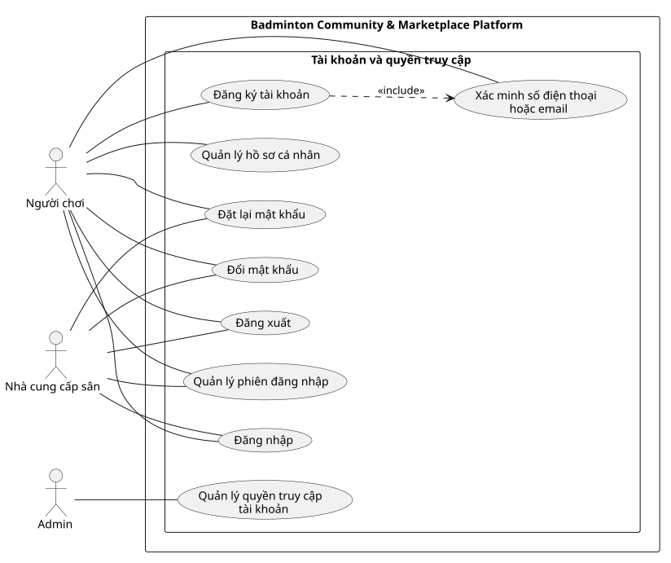

# Use Case Index - Tài khoản và quyền truy cập

## Diagram

## Actors

| Actor | Loại | Mô tả | Nguồn |
|---|---|---|---|
| Người chơi | Primary | Đăng ký và tự quản lý tài khoản cá nhân. | ACT-01; F-IAM-01 đến F-IAM-08, F-IAM-10 |
| Nhà cung cấp sân | Primary | Sử dụng tài khoản cá nhân đã được gắn với phạm vi nhà cung cấp. | ACT-04; quyết định quyền nhà cung cấp thống nhất |
| Admin | Primary | Quản lý trạng thái truy cập và phê duyệt vai trò đặc biệt. | ACT-05; F-IAM-09, F-ADM-02 |

## Use cases

| Use Case ID | Slug | Tên Use Case | Actor chính | Actor phụ | Nguồn chức năng | Ưu tiên | Giai đoạn | Trạng thái | Updated |
|---|---|---|---|---|---|---|---:|---|---|
| UC-dang-ky-tai-khoan | dang-ky-tai-khoan | Đăng ký tài khoản | Người chơi | Không có | F-IAM-01 | P0 | 1 | Đã xác nhận | 2026-07-19 |
| UC-xac-minh-lien-he | xac-minh-lien-he | Xác minh số điện thoại hoặc email | Người chơi | Không có | F-IAM-04 | P0 | 1 | Đã xác nhận | 2026-07-19 |
| UC-dang-nhap | dang-nhap | Đăng nhập | Người chơi | Nhà cung cấp sân | F-IAM-02 | P0 | 1 | Đã xác nhận | 2026-07-19 |
| UC-dang-xuat | dang-xuat | Đăng xuất | Người chơi | Nhà cung cấp sân | F-IAM-03 | P1 | 1 | Đã xác nhận | 2026-07-19 |
| UC-dat-lai-mat-khau | dat-lai-mat-khau | Đặt lại mật khẩu | Người chơi | Nhà cung cấp sân | F-IAM-05 | P0 | 1 | Đã xác nhận | 2026-07-19 |
| UC-quan-ly-ho-so-ca-nhan | quan-ly-ho-so-ca-nhan | Quản lý hồ sơ cá nhân | Người chơi | Không có | F-IAM-06, F-IAM-10 | P1 | 1 | Đã xác nhận | 2026-07-19 |
| UC-doi-mat-khau | doi-mat-khau | Đổi mật khẩu | Người chơi | Nhà cung cấp sân | F-IAM-07 | P1 | 1 | Đã xác nhận | 2026-07-19 |
| UC-quan-ly-phien-dang-nhap | quan-ly-phien-dang-nhap | Quản lý phiên đăng nhập | Người chơi | Nhà cung cấp sân | F-IAM-08 | P1 | 1 | Đã xác nhận | 2026-07-19 |
| UC-quan-ly-quyen-truy-cap | quan-ly-quyen-truy-cap | Quản lý quyền truy cập tài khoản | Admin | Người chơi, Nhà cung cấp sân | F-IAM-09, F-ADM-02 | P0 | 1 | Đã xác nhận | 2026-07-19 |

## Relationship evidence

| Type | From | To | Rationale | Có nên vẽ |
|---|---|---|---|---|
| include | UC-dang-ky-tai-khoan | UC-xac-minh-lien-he | Đăng ký chỉ hoàn tất khi kênh liên hệ được xác minh. | Có |
| association | Admin | UC-quan-ly-quyen-truy-cap | Admin là vai trò duy nhất được khóa, mở và phê duyệt quyền đặc biệt. | Có |
| association | Nhà cung cấp sân | UC-dang-nhap, UC-dang-xuat, UC-dat-lai-mat-khau, UC-doi-mat-khau, UC-quan-ly-phien-dang-nhap | Nhà cung cấp sử dụng cùng cơ chế tài khoản nhưng vẫn giữ vai trò nghiệp vụ riêng. | Có |

## Cross-module dependencies

- `UC-quan-ly-quyen-truy-cap` cung cấp điều kiện quyền cho đăng ký Nhà cung cấp sân và Người tổ chức chuyên nghiệp.
- Không đưa các thao tác OTP riêng thành Use Case vì chúng là bước trong xác minh liên hệ.

## Relationships

| Type | From | To | Rationale |
|---|---|---|---|
| association | Người chơi | UC-dang-ky-tai-khoan | Người chơi khởi tạo tài khoản cá nhân. |
| association | Người chơi | UC-xac-minh-lien-he | Người chơi xác minh kênh liên hệ của tài khoản. |
| association | Người chơi | UC-dang-nhap | Người chơi xác thực để truy cập hệ thống. |
| association | Người chơi | UC-dang-xuat | Người chơi chủ động kết thúc phiên truy cập. |
| association | Người chơi | UC-dat-lai-mat-khau | Người chơi khôi phục quyền truy cập khi quên mật khẩu. |
| association | Người chơi | UC-quan-ly-ho-so-ca-nhan | Người chơi cập nhật và quản lý hồ sơ cá nhân. |
| association | Người chơi | UC-doi-mat-khau | Người chơi thay đổi mật khẩu của tài khoản. |
| association | Người chơi | UC-quan-ly-phien-dang-nhap | Người chơi xem và kiểm soát các phiên đăng nhập. |
| association | Nhà cung cấp sân | UC-dang-nhap | Nhà cung cấp sân sử dụng cơ chế đăng nhập chung. |
| association | Nhà cung cấp sân | UC-dang-xuat | Nhà cung cấp sân sử dụng cơ chế đăng xuất chung. |
| association | Nhà cung cấp sân | UC-dat-lai-mat-khau | Nhà cung cấp sân sử dụng cơ chế đặt lại mật khẩu chung. |
| association | Nhà cung cấp sân | UC-doi-mat-khau | Nhà cung cấp sân sử dụng cơ chế đổi mật khẩu chung. |
| association | Nhà cung cấp sân | UC-quan-ly-phien-dang-nhap | Nhà cung cấp sân kiểm soát các phiên đăng nhập của mình. |
| association | Admin | UC-quan-ly-quyen-truy-cap | Admin khóa, mở và phê duyệt quyền truy cập đặc biệt. |
| include | UC-dang-ky-tai-khoan | UC-xac-minh-lien-he | Đăng ký chỉ hoàn tất khi kênh liên hệ được xác minh. |
