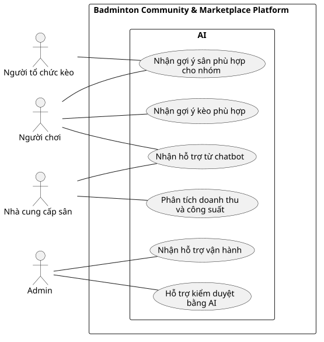

# Use Case Index - AI

## Diagram

## Actors

| Actor | Loại | Mô tả | Nguồn |
|---|---|---|---|
| Người chơi | Primary | Nhận gợi ý kèo, gợi ý sân và hỗ trợ chatbot. | ACT-01; F-AI-01 đến F-AI-03 |
| Người tổ chức kèo | Primary | Nhận gợi ý sân cho nhóm và dùng dữ liệu Passport để đánh giá mức phù hợp. | ACT-02; F-AI-01, F-AI-02 |
| Nhà cung cấp sân | Primary | Nhận phân tích doanh thu, công suất và gợi ý giá hoặc khuyến mãi. | ACT-04; F-AI-04 |
| Admin | Primary | Nhận hỗ trợ kiểm duyệt và trợ lý vận hành. | ACT-05; F-AI-05, F-AI-06 |

## Use cases

| Use Case ID | Slug | Tên Use Case | Actor chính | Actor phụ | Nguồn chức năng | Ưu tiên | Giai đoạn | Trạng thái | Updated |
|---|---|---|---|---|---|---|---:|---|---|
| UC-nhan-goi-y-keo-phu-hop | nhan-goi-y-keo-phu-hop | Nhận gợi ý kèo phù hợp | Người chơi | Không có | F-AI-01 | P1 | 2 | Đã xác nhận | 2026-07-19 |
| UC-nhan-goi-y-san-cho-nhom | nhan-goi-y-san-cho-nhom | Nhận gợi ý sân phù hợp cho nhóm | Người chơi | Người tổ chức kèo | F-AI-02 | P1 | 2 | Đã xác nhận | 2026-07-19 |
| UC-nhan-ho-tro-tu-chatbot | nhan-ho-tro-tu-chatbot | Nhận hỗ trợ từ chatbot | Người chơi | Nhà cung cấp sân | F-AI-03 | P1 | 2 | Đã xác nhận | 2026-07-19 |
| UC-phan-tich-doanh-thu-va-cong-suat | phan-tich-doanh-thu-va-cong-suat | Phân tích doanh thu và công suất | Nhà cung cấp sân | Không có | F-AI-04 | P2 | 3 | Đã xác nhận | 2026-07-19 |
| UC-ho-tro-kiem-duyet-bang-ai | ho-tro-kiem-duyet-bang-ai | Hỗ trợ kiểm duyệt bằng AI | Admin | Không có | F-AI-05 | P1 | 2 | Đã xác nhận | 2026-07-19 |
| UC-nhan-ho-tro-van-hanh | nhan-ho-tro-van-hanh | Nhận hỗ trợ vận hành | Admin | Không có | F-AI-06 | P2 | 3 | Đã xác nhận | 2026-07-19 |

## Relationship evidence

Không có quan hệ `include`, `extend` hoặc `generalization` đủ bằng chứng giữa sáu Use Case AI. Chúng dùng chung nguyên tắc kiểm soát nhưng phục vụ các mục tiêu và Actor khác nhau.

## Cross-module dependencies

- AI Matchmaker dùng ràng buộc cứng, sở thích mềm, Player Passport và lịch kèo; phải giải thích lý do xếp hạng và không tự tham gia hoặc thanh toán.
- Smart Court Recommendation cân bằng vị trí thành viên, thời gian, hình thức chơi, trình độ, ngân sách, tiện ích, giá và lịch trống thực tế; không tự giữ hoặc đặt sân.
- Chatbot chỉ đọc dữ liệu được phép về tài khoản, booking, thanh toán và kèo; không đổi trạng thái giao dịch và có thể bàn giao sang chat Admin.
- AI Revenue Analysis cung cấp heatmap, dự báo, cảnh báo và gợi ý; nhà cung cấp quyết định giá hoặc khuyến mãi.
- AI moderation có thể tự ẩn spam, lừa đảo hoặc lộ dữ liệu rõ ràng; trường hợp không chắc chắn chuyển Admin, quyết định xóa vĩnh viễn và xử lý tài khoản thuộc Admin.
- Admin Operations Assistant chỉ tóm tắt, ưu tiên, liên kết bằng chứng và soạn phản hồi; Admin thực hiện hành động cuối.

## Relationships

| Type | From | To | Rationale |
|---|---|---|---|
| association | Người chơi | UC-nhan-goi-y-keo-phu-hop | Người chơi trực tiếp nhận gợi ý kèo phù hợp. |
| association | Người chơi | UC-nhan-goi-y-san-cho-nhom | Người chơi trực tiếp nhận gợi ý sân phù hợp cho nhóm. |
| association | Người chơi | UC-nhan-ho-tro-tu-chatbot | Người chơi trực tiếp nhận hỗ trợ từ chatbot. |
| association | Người tổ chức kèo | UC-nhan-goi-y-san-cho-nhom | Người tổ chức kèo dùng gợi ý sân để lựa chọn địa điểm phù hợp cho nhóm. |
| association | Nhà cung cấp sân | UC-nhan-ho-tro-tu-chatbot | Nhà cung cấp sân có thể nhận hỗ trợ từ chatbot. |
| association | Nhà cung cấp sân | UC-phan-tich-doanh-thu-va-cong-suat | Nhà cung cấp sân trực tiếp nhận kết quả phân tích doanh thu và công suất. |
| association | Admin | UC-ho-tro-kiem-duyet-bang-ai | Admin nhận hỗ trợ phát hiện và phân loại nội dung cần kiểm duyệt. |
| association | Admin | UC-nhan-ho-tro-van-hanh | Admin trực tiếp nhận tóm tắt và đề xuất hỗ trợ vận hành. |
