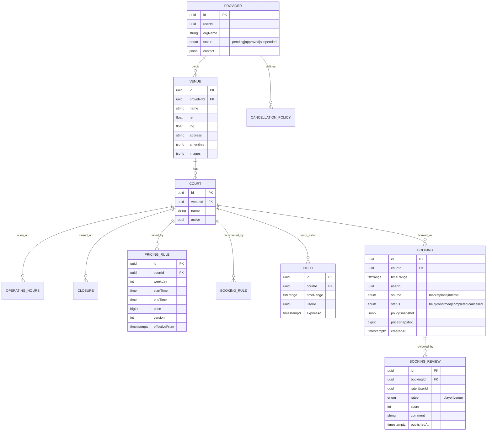
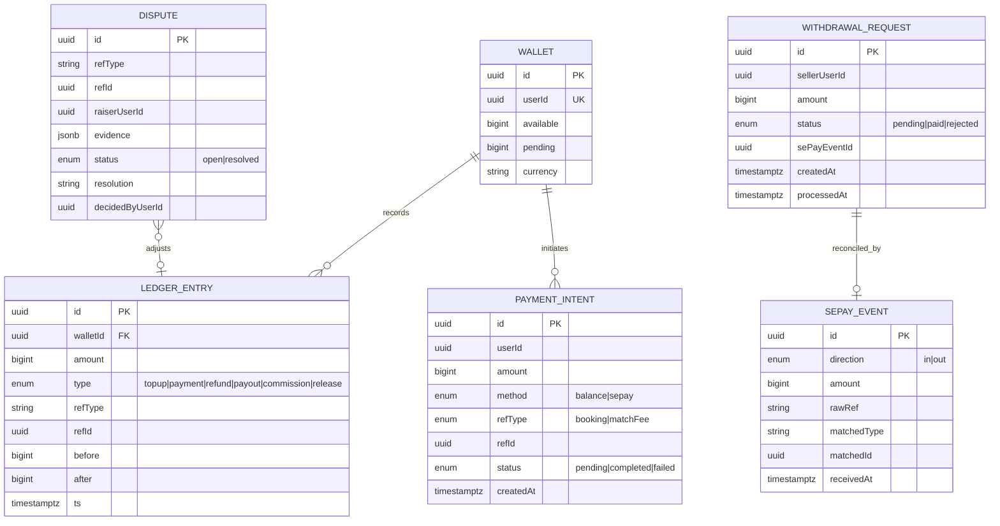
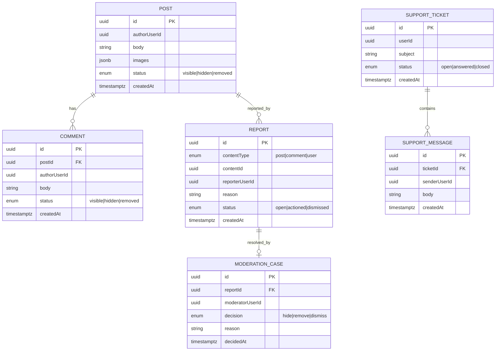
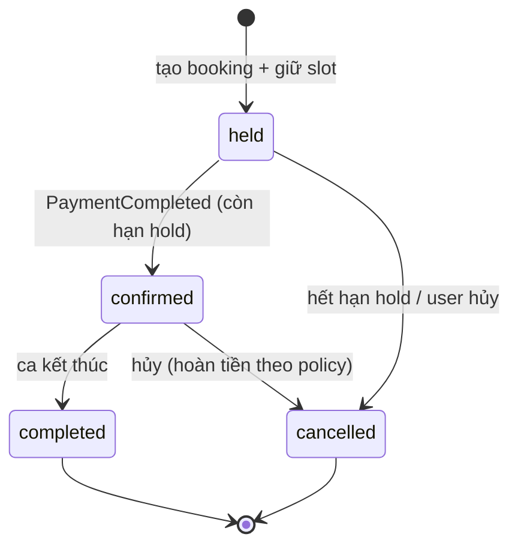
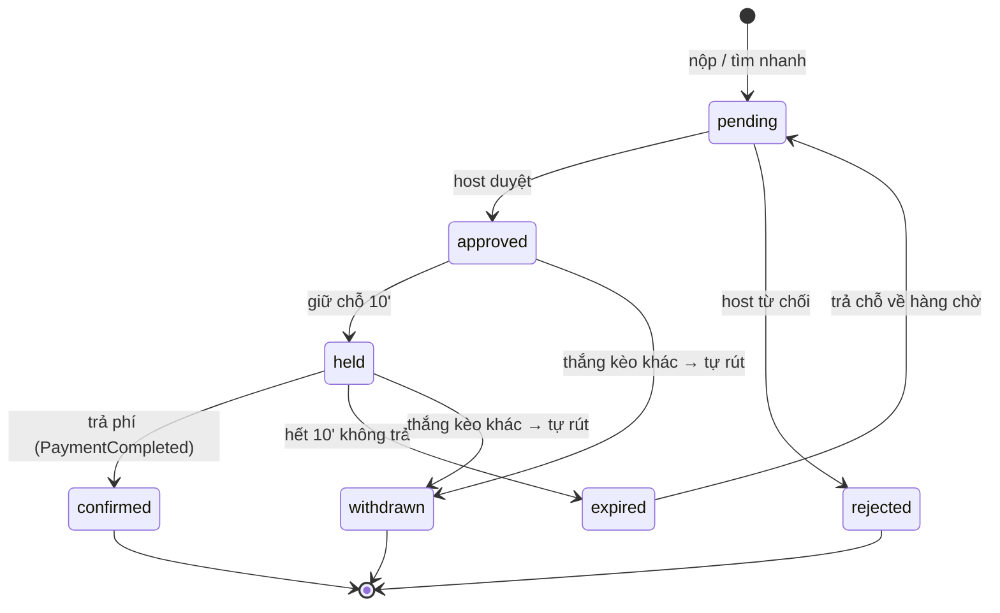
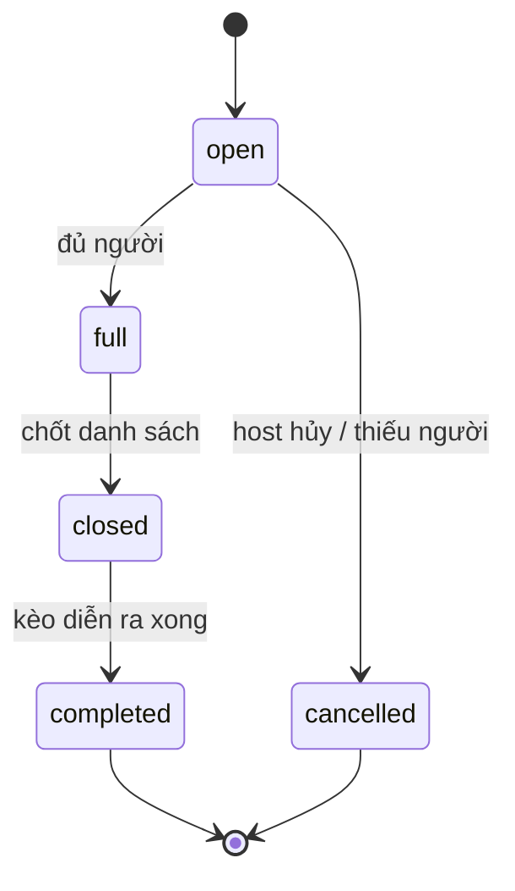
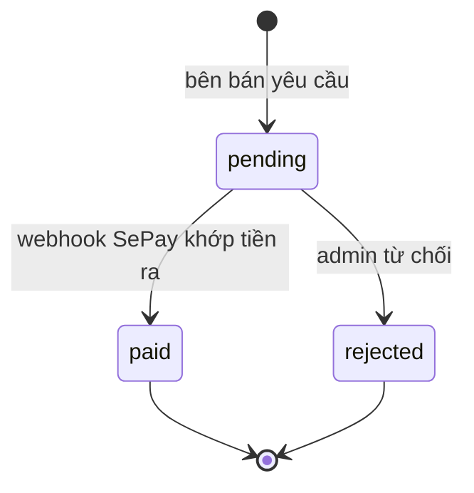

# Data model — đầy đủ 5 service

Mỗi service một schema Postgres riêng. `userId` là **tham chiếu** sang account-service, không FK chéo schema.
Mỗi service còn có 2 bảng hạ tầng: `Outbox` (publish event) và `ProcessedEvent` (idempotency) — xem mục 7.

## 1. account-service

```mermaid
erDiagram
    USER ||--o| PLAYER_PROFILE : has
    USER ||--o{ VERIFICATION : requests
    USER ||--o{ PASSWORD_RESET : requests
    USER ||--o{ ACCOUNT_AUDIT : target_of

    USER {
        uuid id PK
        string email UK
        string phone
        string passwordHash
        enum role "player|provider|admin"
        bool verified
        enum status "active|locked"
        timestamptz createdAt
    }
    PLAYER_PROFILE {
        uuid userId PK_FK
        string displayName
        string avatarUrl
        jsonb preferences
        enum visibility "public|private"
    }
    VERIFICATION {
        uuid id PK
        uuid userId FK
        enum channel "email|phone"
        string code
        timestamptz expiresAt
        timestamptz consumedAt
    }
    PASSWORD_RESET {
        uuid id PK
        uuid userId FK
        string token
        timestamptz expiresAt
        timestamptz consumedAt
    }
    ACCOUNT_AUDIT {
        uuid id PK
        uuid actorUserId
        string action
        uuid targetUserId
        string reason
        timestamptz ts
    }
```
Token blacklist (đăng xuất/thu hồi) để ở Redis, không ở DB.

## 2. venue-booking-service


**Chống đặt trùng:** `EXCLUDE` constraint trên `(courtId, timeRange)` cho booking `confirmed` + advisory lock khi tạo hold.

## 3. finance-service



## 4. matchmaking-service


**Player Passport** = view tổng hợp trên `PLAYER_RATING` + lịch sử `PARTICIPANT` + `MATCH_REVIEW` (không phải bảng riêng).

## 5. community-service



## 6. State machine — thực thể có vòng đời

### Booking


### WaitlistEntry (ghép kèo)


### Match


### WithdrawalRequest


## 7. Bảng hạ tầng chung (mỗi service)

| Bảng | Cột | Vai trò |
|---|---|---|
| `Outbox` | id, aggregateType, aggregateId, eventType, payload, createdAt, publishedAt | Ghi cùng transaction domain → relay publish RabbitMQ |
| `ProcessedEvent` | eventId PK, processedAt | Idempotency cho consumer (bỏ qua event trùng) |
