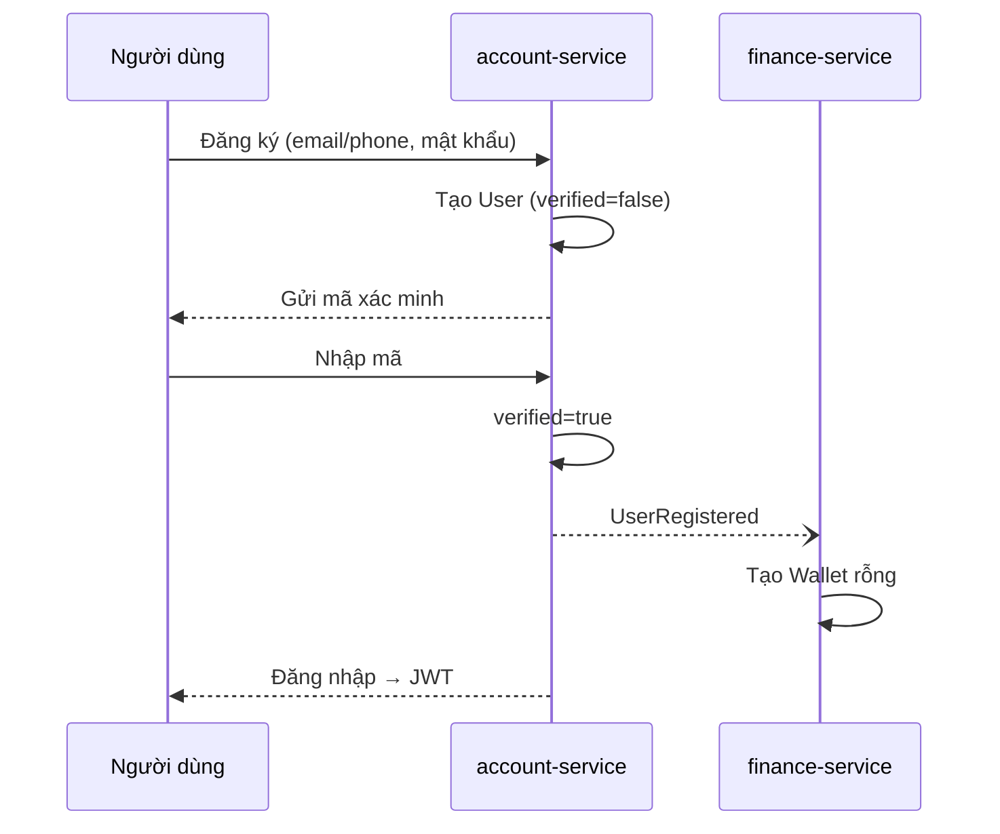
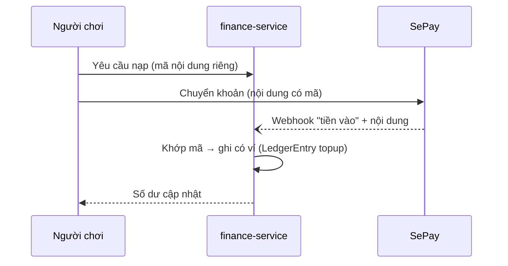
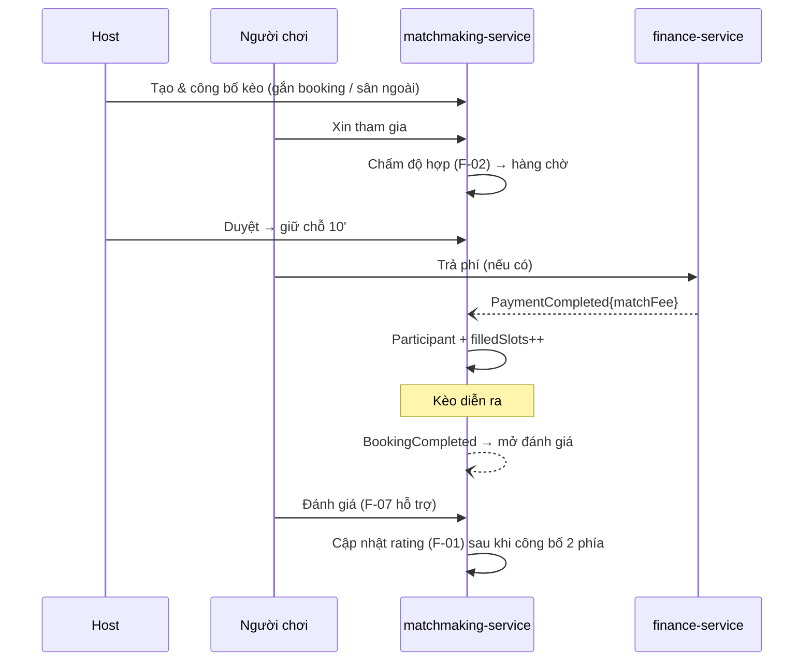
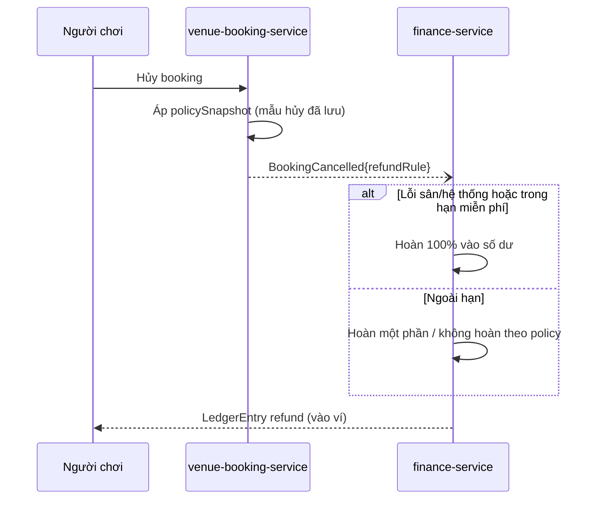
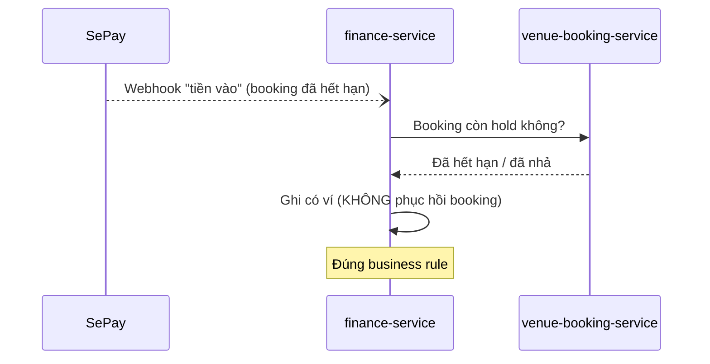
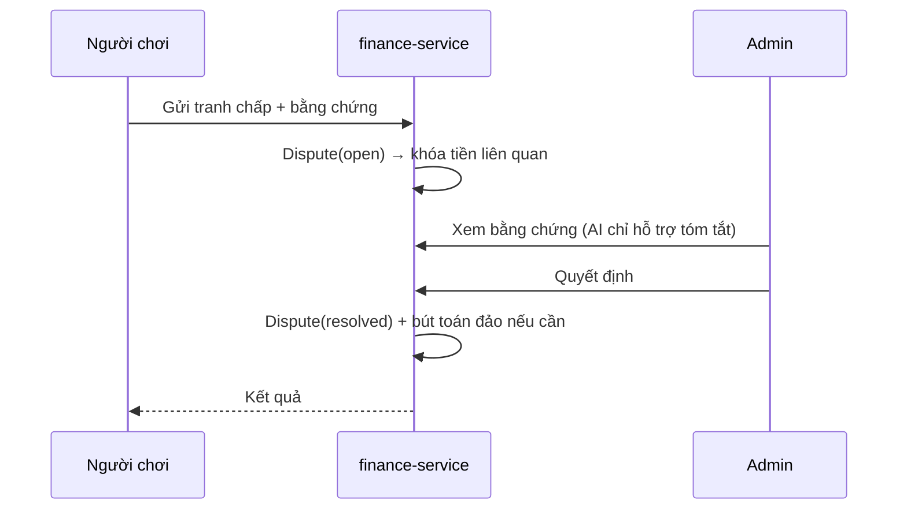

# Luồng chính

3 luồng đã vẽ ở [system-architecture.md](system-architecture.md) mục 8: **đặt sân+thanh toán**,
**ghép kèo live (F-03)**, **rút tiền+đối soát SePay**. File này bổ sung các luồng còn lại.

## 1. Đăng ký + xác minh



## 2. Nạp số dư qua SePay



## 3. Vòng đời kèo (tạo → tham gia → chơi → đánh giá)



## 4. Hủy + hoàn tiền theo policy



## 5. Thanh toán đến muộn (sau khi hết hạn hold)



## 6. Tranh chấp giao dịch



## 7. Báo cáo + kiểm duyệt nội dung

```mermaid
sequenceDiagram
    participant U as Người dùng
    participant COM as community-service
    participant A as Admin
    U->>COM: Báo cáo bài/bình luận
    COM->>COM: Report(open) → ModerationCase
    A->>COM: Xem hàng đợi kiểm duyệt
    A->>COM: Quyết định (hide/remove/dismiss)
    COM->>COM: Cập nhật trạng thái nội dung
    Note over COM: Kiểm duyệt do người (admin); không AI tự ẩn
```

## Ghi chú
- Mọi luồng chạm tiền đều qua **finance-service** và ghi **LedgerEntry append-only**.
- Event bất đồng bộ dùng **outbox + RabbitMQ**; consumer idempotent (mục 6 system-architecture).
- AI xuất hiện ở luồng chỉ với vai trò **hỗ trợ** (F-02 độ hợp, F-07 tóm tắt) — không tự quyết.
