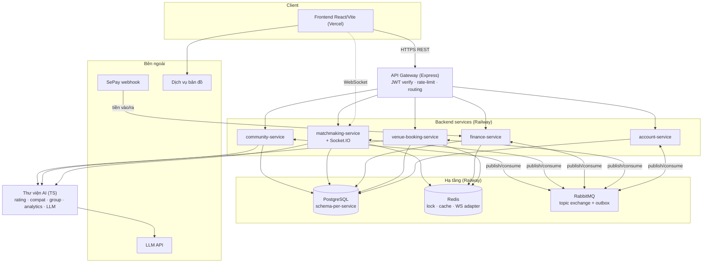
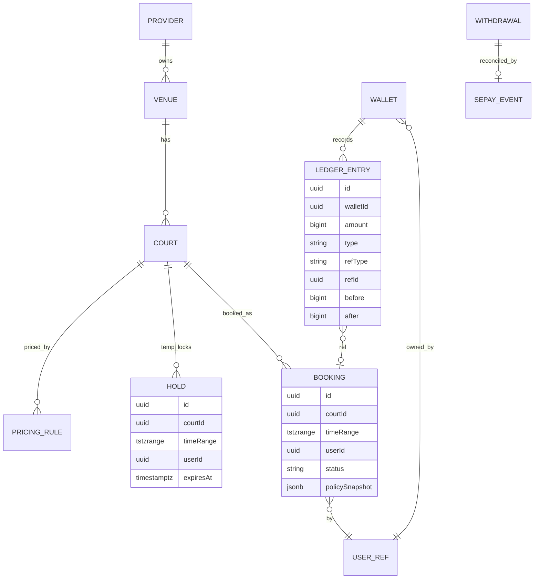
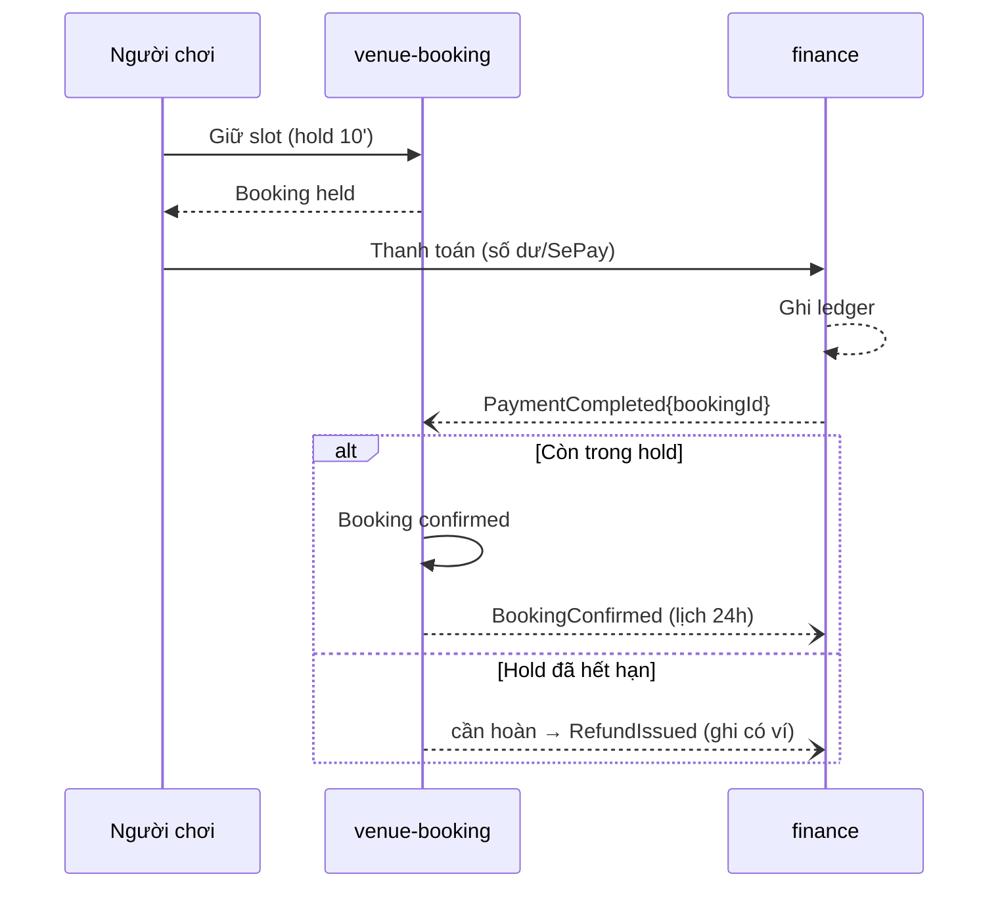
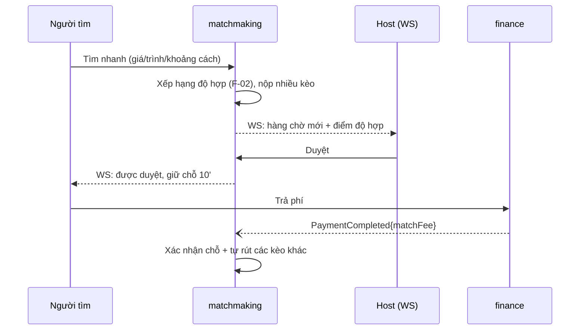
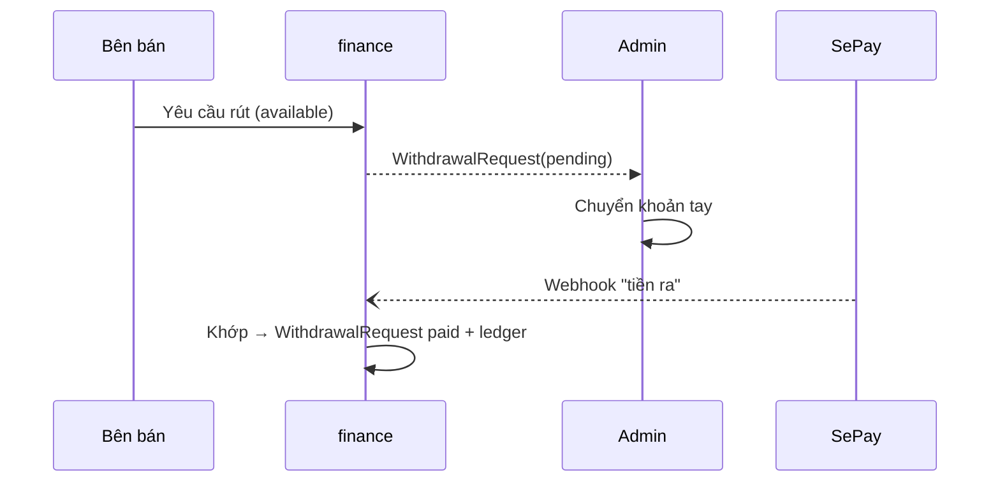

# Kiến trúc hệ thống — Nền tảng cầu lông

Tài liệu kiến trúc cho toàn dự án theo ADR 0002 (microservices, 5 service + gateway).
Đây là nguồn cho bước tiếp theo: spec (user story + AC) và code.

## 1. Nguyên tắc kiến trúc

1. **Microservices theo domain** — 5 service + API Gateway; mỗi service sở hữu dữ liệu riêng.
2. **Database-per-service (logic)** — mỗi service một **schema Postgres riêng**; không service nào join sang schema của service khác. Thực dụng: một Postgres instance trên Railway, nhiều schema (tiết kiệm chi phí, vẫn giữ nguyên tắc data ownership). *Nâng lên database tách hẳn nếu sau này cần.*
3. **Auth tập trung ở biên** — `account-service` phát hành JWT; `api-gateway` verify; các service tin JWT đã verify, chỉ lưu `userId` tham chiếu (không FK chéo service).
4. **Đồng bộ cho đọc, bất đồng bộ cho lan tỏa trạng thái** — REST qua gateway cho request-response; **RabbitMQ + outbox** cho sự kiện giữa service.
5. **AI là thư viện dùng chung**, không service riêng — import vào nơi cần.
6. **Nhất quán bằng saga + outbox**, không distributed transaction. Bù trừ khi lỗi.
7. **Mỏng nhất có thể** — chỉ thêm thành phần khi có nhu cầu kiểm chứng được.

## 2. Tổng quan hệ thống



## 3. Ánh xạ module → service

| Module (7) | Service | Ghi chú |
|---|---|---|
| account-access | `account-service` | Auth, hồ sơ, quản lý tài khoản |
| venue-scheduling + court-booking | `venue-booking-service` | Gộp: lịch và booking cùng DB → chống đặt trùng sạch |
| finance-disputes | `finance-service` | Ví, ledger, SePay, rút tiền, tranh chấp |
| matchmaking-passport | `matchmaking-service` | Kèo, Passport, F-01/03/04, WebSocket |
| community-support | `community-service` | Bài viết, kiểm duyệt, hỗ trợ, chatbot |
| ai | **Thư viện dùng chung** | F-02/05, rating F-01, group F-04, LLM |

## 4. Chi tiết từng service

### 4.1. api-gateway
- **Trách nhiệm:** một cửa vào; verify JWT; rate-limit; CORS/helmet; định tuyến tới service; proxy nâng cấp WebSocket tới `matchmaking-service` (hoặc client nối thẳng URL WS của matchmaking).
- **Không** chứa nghiệp vụ; không DB.
- **Tech:** Express + http-proxy-middleware + express-rate-limit.

### 4.2. account-service
- **Sở hữu:** danh tính và quyền truy cập.
- **Entities:** `User(id, email, phone, passwordHash, role[player|provider|admin], verified)`, `PlayerProfile(userId, displayName, preferences, visibility)`, `Verification(userId, channel, code, expiresAt)`, `PasswordReset`. Token blacklist ở Redis (JWT stateless + refresh).
- **API sync:** đăng ký/đăng nhập/đăng xuất, verify, đổi/quên mật khẩu, hồ sơ, admin khóa/khôi phục tài khoản.
- **Publish:** `UserRegistered`, `AccountLocked`.
- **UC:** account-access (8).

### 4.3. venue-booking-service
- **Sở hữu:** nhà cung cấp, sân, lịch, giá, **booking** (nguồn lịch chính thức + chống đặt trùng).
- **Entities:** `Provider(userId, profile, status)`, `Venue(providerId, name, lat, lng, amenities, images)`, `Court(venueId, name)`, `OperatingHours`, `PricingRule(courtId, weekday, timeRange, price, version)`, `BookingRule(courtId, step, minDur, maxDur)`, `Hold(courtId, timeRange, userId, expiresAt)`, `Booking(courtId, timeRange, userId, status[held|confirmed|completed|cancelled], policySnapshot)`, `CancellationPolicyTemplate`.
- **Chống đặt trùng:** unique constraint trên `(courtId, timeRange)` cho booking `confirmed` + **Postgres advisory lock / SELECT FOR UPDATE** khi giữ slot. `Hold` có `expiresAt` (10 phút), job nền quét hết hạn.
- **API sync:** tìm/lọc sân (list + map), chi tiết, lịch trống + giá, chọn slot, giữ slot, tạo booking (held), xem/hủy booking, điều chỉnh phía sân.
- **Publish:** `BookingCreated(held)`, `BookingConfirmed`, `BookingCancelled`, `BookingCompleted`.
- **Consume:** `PaymentCompleted{bookingId}` → xác nhận booking (nếu còn trong hold), ngược lại kích hoàn tiền.
- **Dùng AI lib:** F-05 phân tích nhu cầu / giờ vàng (đọc lịch sử booking).
- **UC:** venue-scheduling (9) + court-booking (10).

### 4.4. finance-service
- **Sở hữu:** tiền. Ranh giới audit/bảo mật — cô lập.
- **Entities:** `Wallet(userId, available, pending)`, `LedgerEntry(walletId, amount, type[topup|payment|refund|payout|commission|release], refType, refId, before, after, ts)` **append-only**, `PaymentIntent`, `SePayEvent(amount, direction[in|out], matchedRef, ts)`, `WithdrawalRequest(sellerId, amount, status[pending|paid], sePayEventId)`, `Dispute(refId, evidence, status, resolution)`, `CommissionConfig(fixedRate)`.
- **SePay:** không có API hoàn tiền. **Nạp** = webhook "tiền vào" → ghi có ví. **Hoàn tiền** = ghi có ví nội bộ (tự động). **Rút** = admin chuyển khoản tay → webhook "tiền ra" tự khớp `WithdrawalRequest` → `paid`.
- **Giữ tiền:** doanh thu vào `pending`, chuyển `available` sau khi ca/kèo kết thúc + hết 24h khiếu nại.
- **API sync:** xem số dư/giao dịch, nạp, thanh toán (số dư/SePay), rút tiền, gửi/giải quyết tranh chấp.
- **Publish:** `PaymentCompleted`, `RefundIssued`, `PayoutCompleted`, `RevenueReleased`.
- **Consume:** `BookingConfirmed`/`BookingCompleted` (lịch giải phóng 24h), `BookingCancelled` (hoàn tiền theo policy), `MatchConfirmed`/`MatchCancelled`.
- **UC:** finance-disputes (13).

### 4.5. matchmaking-service
- **Sở hữu:** kèo, Player Passport, ghép kèo live. **WebSocket ở đây.**
- **Entities:** `Match(hostUserId, bookingRef|externalVenue, type, slots, skillBandCriteria, fee, status[open|full|closed|invite])`, `WaitlistEntry(matchId, userId, compatScore, status[pending|approved|withdrawn|confirmed])`, `Participant`, `PlayerRating(userId, value, uncertainty)` **[F-01]**, `MatchReview`, `QuickMatchSession(userId, filters, active)` **[F-03]**.
- **Realtime:** Socket.IO + **Redis adapter** (chia room across instance). Host subscribe cập nhật hàng chờ; người tìm nhận kết quả duyệt.
- **Ghép kèo live [F-03]:** 2 lối vào (Tìm nhanh + lấp chỗ) → một hàng chờ, xếp theo điểm độ hợp **[F-02]**. Host duyệt → giữ chỗ 10' → trả phí → xác nhận. Nộp nhiều kèo, ai duyệt+trả trước thắng → tự rút phần còn lại.
- **API sync:** tìm/lọc kèo, tạo/công bố, chi tiết, xin tham gia, xét duyệt, xác nhận, rút, hủy, khai báo trình độ, đánh giá, xem Passport, Tìm nhanh.
- **Dùng AI lib:** F-01 rating, F-02 độ hợp, F-04 gom nhóm cân bằng.
- **Publish:** `MatchCreated`, `JoinApproved`, `MatchConfirmed`, `MatchCancelled`.
- **Consume:** `PaymentCompleted{matchFee}` → xác nhận chỗ; `BookingConfirmed` (kèo gắn booking); `BookingCompleted` (mở đánh giá).
- **UC:** matchmaking-passport (11) + F-01/03/04.

### 4.6. community-service
- **Sở hữu:** nội dung công khai, kiểm duyệt, hỗ trợ.
- **Entities:** `Post`, `Comment`, `Report(contentRef, reason, status)`, `ModerationCase(status, decision)`, `SupportTicket(userId, subject, status, messages)` (bất đồng bộ, không realtime).
- **Dùng AI lib:** chatbot hỗ trợ (RAG trên chính sách + dữ liệu của chính user); F-07 trợ lý đánh giá công bằng (soạn tóm tắt, cảnh báo đánh giá bất thường).
- **API sync:** bảng tin, tạo/sửa/xóa bài, bình luận, báo cáo, kiểm duyệt (admin), gửi/xử lý ticket.
- **Publish:** `ContentReported` → tạo moderation case.
- **UC:** community-support (8) + F-07.

> **Đánh giá hai chiều** đặt cùng service sở hữu giao dịch được đánh giá. **Đánh giá booking sân
> KHÔNG thuộc phạm vi GĐ1** (D7 — `BOOKING_REVIEW` không có use case nào được duyệt, đánh dấu
> hoãn). Chỉ đánh giá kèo ở `matchmaking-service` (GĐ2, F-01/03/04/07). F-07 (AI lib) hỗ trợ khi
> triển khai. Tránh nhân bản cơ chế review nếu đánh giá booking được mở lại ở giai đoạn sau.

## 5. Data model — sơ đồ quan hệ lõi

ERD cho hai service quan hệ nhất (venue-booking + finance). Các service khác dùng danh sách entity ở mục 4.



*USER_REF = tham chiếu `userId` sang account-service, không phải FK chéo schema.*

## 6. Giao tiếp liên service

### 6.1. Đồng bộ (REST qua gateway)
Client → gateway → service. Service gọi service khác đồng bộ **hạn chế tối đa**; ưu tiên event bất đồng bộ để tránh coupling.

### 6.2. Bất đồng bộ (RabbitMQ + outbox)
- **Outbox:** mỗi service ghi thay đổi domain **và** một dòng `outbox` trong **cùng một transaction DB**; một relay đọc outbox → publish lên RabbitMQ. Đảm bảo không mất event.
- **Idempotent consumer:** mỗi consumer lưu `processedEventId` để bỏ qua trùng.
- **Topic exchange:** routing key theo `domain.event` (ví dụ `booking.confirmed`).

### 6.3. Danh mục sự kiện

| Event | Producer | Consumer chính |
|---|---|---|
| `UserRegistered` | account | (khởi tạo ví) finance |
| `AccountLocked` | account | các service (khóa hành động) |
| `BookingCreated(held)` | venue-booking | — |
| `BookingConfirmed` | venue-booking | finance (lịch 24h), matchmaking |
| `BookingCancelled` | venue-booking | finance (hoàn tiền) |
| `BookingCompleted` | venue-booking | finance (giải phóng), matchmaking (mở đánh giá) |
| `PaymentCompleted` | finance | venue-booking (xác nhận), matchmaking (xác nhận chỗ) |
| `RefundIssued` | finance | venue-booking, matchmaking |
| `RevenueReleased` | finance | — |
| `PayoutCompleted` | finance | — |
| `MatchCreated` | matchmaking | — |
| `JoinApproved` | matchmaking | finance (chờ phí) |
| `MatchConfirmed` / `MatchCancelled` | matchmaking | finance |
| `ContentReported` | community | (moderation nội bộ) |

## 7. Xuyên suốt (cross-cutting)

- **Identity:** JWT verify ở gateway; service nhận `userId`/`role` từ header đã ký; không FK chéo service.
- **Realtime:** Socket.IO ở matchmaking + Redis adapter; client dùng `transports:['websocket']`.
- **AI library:** package TS chung; rating/compat/group/analytics thuần TS; chatbot/giải thích/fair-rating gọi LLM API. **AI chỉ hỗ trợ, không tự thực hiện hành động nhạy cảm** (ràng buộc baseline).
- **Nhất quán phân tán:**
  - *Chống đặt trùng:* nội bộ venue-booking (Postgres lock + unique constraint).
  - *Ví/ledger:* append-only + outbox; bù trừ bằng bút toán đảo khi hoàn/hủy.
  - *Giữ tiền 24h:* finance lịch chuyển `pending → available`.
  - *Thanh toán đến muộn:* ghi có ví, **không** phục hồi booking hết hạn.
- **Audit:** hành động tiền/quyền/admin ghi append-only (finance + account), không sửa/xóa mất dấu.

## 8. Luồng chính

### 8.1. Đặt sân + thanh toán (saga)



### 8.2. Ghép kèo live (F-03)



### 8.3. Rút tiền + đối soát SePay



## 9. Cấu trúc thư mục (monorepo)

```
/ (npm/pnpm workspaces)
├── apps/
│   └── web/                    # React + Vite (Vercel)
├── services/
│   ├── api-gateway/
│   ├── account-service/
│   ├── venue-booking-service/
│   ├── finance-service/
│   ├── matchmaking-service/
│   └── community-service/
├── packages/
│   ├── ai/                     # thư viện AI dùng chung
│   ├── shared/                 # types/DTO/event schema dùng chung
│   └── eventbus/               # helper RabbitMQ + outbox
└── infra/                      # script chạy local (concurrently), env mẫu
```

- **Monorepo** (workspaces): 1 dev, chia sẻ types/event schema qua `packages/shared`, AI qua `packages/ai`.
- Mỗi service: `src/{routes,controllers,domain,repo,events}`, `prisma/schema.prisma` (schema riêng).

## 10. Quyết định cần PO xác nhận

| # | Quyết định | Mặc định đề xuất | Trạng thái |
|---|---|---|---|
| 1 | DB tách hẳn hay schema-per-service | **Schema-per-service** trong 1 Postgres (rẻ, đủ nguyên tắc) | ✅ **Chốt 2026-08-05** (D17) — đúng đề xuất, cộng thêm: mỗi service có migration, tài khoản truy cập và quyền sở hữu schema riêng; không FK, không truy vấn xuyên schema; giao tiếp chỉ qua API hoặc event |
| 2 | Monorepo hay nhiều repo | **Monorepo** (workspaces) | ✅ **Chốt 2026-08-05** (D18) — đúng đề xuất, cộng thêm: chỉ chia sẻ contract/DTO/event schema và thư viện hạ tầng; không chia sẻ entity hay business logic xuyên service |
| 3 | Client nối WS thẳng matchmaking hay qua gateway | **Thẳng matchmaking** (đơn giản, tránh gateway giữ kết nối) | Thuộc GĐ2 (`matchmaking-service`), không chặn GĐ1. Chốt khi spec GĐ2 |
| 4 | Ví khởi tạo khi đăng ký hay khi giao dịch đầu | Khi `UserRegistered` (finance tạo sẵn ví rỗng) | ✅ Đã chốt bởi spec GĐ1, thay thế mục này: ví `personal` tạo khi xác minh email (`AC-ACC-02-5`), ví `business` tạo khi duyệt nhà cung cấp (`AC-VEN-02-1`). Xem [ADR 0003](../decisions/0003-multi-role-dual-wallet.md) |

## 11. Ghi chú phạm vi

Kiến trúc này phủ **toàn bộ 7 module + 6 tính năng mới**. Thứ tự **thực thi** không còn theo build
order lát cắt dọc — đã chốt bằng **D1** (đơn vị phân giai đoạn là module trọn vẹn). Thứ tự triển
khai có thẩm quyền nằm ở [phase-1-handoff.md §2](../product/phase-1-handoff.md): `Gboot → G0 →
Gdesign → G1 → G2 → G3 → G4 → (G5 ∥ G6) → G7`, phủ trọn account + venue-booking + finance ở GĐ1;
matchmaking + community + AI lib thuộc GĐ2.
