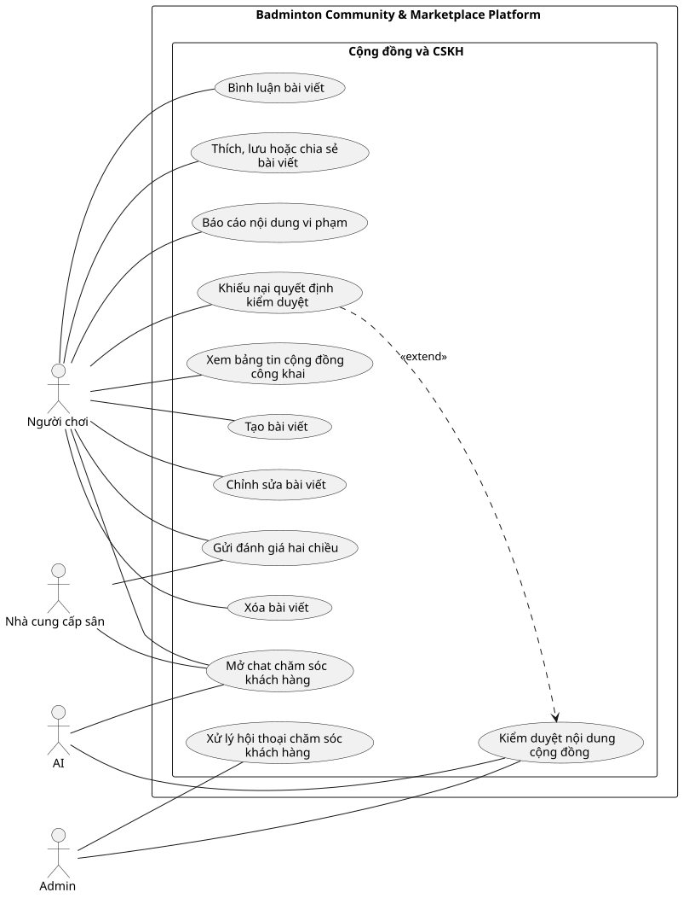

# Use Case Index - Cộng đồng và CSKH

## Diagram

## Actors

| Actor | Loại | Mô tả | Nguồn |
|---|---|---|---|
| Người chơi | Primary | Xem và tạo nội dung, tương tác, báo cáo, đánh giá và yêu cầu hỗ trợ. | ACT-01; F-COM-01 đến F-COM-06, F-COM-09 đến F-COM-11 |
| Nhà cung cấp sân | Primary | Tham gia đánh giá hai chiều và mở yêu cầu hỗ trợ liên quan đến vận hành. | ACT-04; F-COM-09, F-COM-11 |
| Admin | Primary | Kiểm duyệt nội dung, xử lý khiếu nại và trả lời chat chăm sóc khách hàng. | ACT-05; F-COM-08, F-COM-12 |
| AI | System | Phân loại nội dung và chuyển chatbot sang Admin kèm ngữ cảnh. | ACT-08; F-COM-07, F-COM-12 |

## Use cases

| Use Case ID | Slug | Tên Use Case | Actor chính | Actor phụ | Nguồn chức năng | Ưu tiên | Giai đoạn | Trạng thái | Updated |
|---|---|---|---|---|---|---|---:|---|---|
| UC-xem-bang-tin-cong-khai | xem-bang-tin-cong-khai | Xem bảng tin cộng đồng công khai | Người chơi | Không có | F-COM-01 | P1 | 2 | Đã xác nhận | 2026-07-19 |
| UC-tao-bai-viet | tao-bai-viet | Tạo bài viết | Người chơi | Không có | F-COM-02, F-COM-07 | P1 | 2 | Đã xác nhận | 2026-07-19 |
| UC-chinh-sua-bai-viet | chinh-sua-bai-viet | Chỉnh sửa bài viết | Người chơi | Không có | F-COM-02, F-COM-07 | P1 | 2 | Đã xác nhận | 2026-07-19 |
| UC-xoa-bai-viet | xoa-bai-viet | Xóa bài viết | Người chơi | Không có | F-COM-02 | P1 | 2 | Đã xác nhận | 2026-07-19 |
| UC-binh-luan-bai-viet | binh-luan-bai-viet | Bình luận bài viết | Người chơi | Không có | F-COM-03, F-COM-07 | P1 | 2 | Đã xác nhận | 2026-07-19 |
| UC-tuong-tac-bai-viet | tuong-tac-bai-viet | Thích, lưu hoặc chia sẻ bài viết | Người chơi | Không có | F-COM-04 | P2 | 2 | Giả định | 2026-07-19 |
| UC-bao-cao-noi-dung | bao-cao-noi-dung | Báo cáo nội dung vi phạm | Người chơi | Admin | F-COM-06 | P1 | 2 | Đã xác nhận | 2026-07-19 |
| UC-kiem-duyet-noi-dung | kiem-duyet-noi-dung | Kiểm duyệt nội dung cộng đồng | Admin | AI | F-COM-07, F-COM-08 | P0 | 2 | Đã xác nhận | 2026-07-19 |
| UC-khieu-nai-kiem-duyet | khieu-nai-kiem-duyet | Khiếu nại quyết định kiểm duyệt | Người chơi | Admin | F-COM-08 | P1 | 2 | Đã xác nhận | 2026-07-19 |
| UC-gui-danh-gia-hai-chieu | gui-danh-gia-hai-chieu | Gửi đánh giá hai chiều | Người chơi | Nhà cung cấp sân | F-COM-09, F-COM-10 | P1 | 2 | Đã xác nhận | 2026-07-19 |
| UC-mo-chat-cskh | mo-chat-cskh | Mở chat chăm sóc khách hàng | Người chơi | Nhà cung cấp sân, AI | F-COM-11, F-COM-12 | P0 | 2 | Đã xác nhận | 2026-07-19 |
| UC-xu-ly-chat-cskh | xu-ly-chat-cskh | Xử lý hội thoại chăm sóc khách hàng | Admin | Người chơi, Nhà cung cấp sân | F-COM-11, F-COM-12 | P0 | 2 | Đã xác nhận | 2026-07-19 |

## Relationship evidence

| Type | From | To | Rationale | Có nên vẽ |
|---|---|---|---|---|
| extend | UC-khieu-nai-kiem-duyet | UC-kiem-duyet-noi-dung | Khiếu nại chỉ phát sinh sau quyết định kiểm duyệt; kiểm duyệt vẫn hoàn chỉnh khi không có khiếu nại. | Có |

## Cross-module dependencies

- Chỉ booking hoặc kèo đã hoàn thành và được xác thực mới đủ điều kiện đánh giá hai chiều.
- Đánh giá được công bố khi cả hai bên đã gửi hoặc hết thời hạn, nhằm giảm trả đũa.
- Chat là riêng tư giữa người dùng và Admin; không bao gồm chat ngang hàng hoặc chat nhóm.
- Hộp thư Admin có trạng thái, lịch sử, đã đọc và liên kết ngữ cảnh tới booking, thanh toán hoặc kèo.
- Không có CLB, vai trò CLB hoặc bài viết riêng của CLB.

## Relationships

| Type | From | To | Rationale |
|---|---|---|---|
| association | Người chơi | UC-xem-bang-tin-cong-khai | Người chơi trực tiếp xem bảng tin cộng đồng. |
| association | Người chơi | UC-tao-bai-viet | Người chơi trực tiếp tạo bài viết. |
| association | Người chơi | UC-chinh-sua-bai-viet | Người chơi trực tiếp chỉnh sửa bài viết của mình. |
| association | Người chơi | UC-xoa-bai-viet | Người chơi trực tiếp xóa bài viết của mình. |
| association | Người chơi | UC-binh-luan-bai-viet | Người chơi trực tiếp bình luận bài viết. |
| association | Người chơi | UC-tuong-tac-bai-viet | Người chơi trực tiếp thích, lưu hoặc chia sẻ bài viết. |
| association | Người chơi | UC-bao-cao-noi-dung | Người chơi trực tiếp báo cáo nội dung vi phạm. |
| association | Người chơi | UC-khieu-nai-kiem-duyet | Người chơi trực tiếp khiếu nại quyết định kiểm duyệt. |
| association | Người chơi | UC-gui-danh-gia-hai-chieu | Người chơi trực tiếp gửi đánh giá. |
| association | Người chơi | UC-mo-chat-cskh | Người chơi trực tiếp mở chat chăm sóc khách hàng. |
| association | Nhà cung cấp sân | UC-gui-danh-gia-hai-chieu | Nhà cung cấp sân là một bên của cơ chế đánh giá hai chiều. |
| association | Nhà cung cấp sân | UC-mo-chat-cskh | Nhà cung cấp sân có thể mở yêu cầu hỗ trợ vận hành. |
| association | Admin | UC-kiem-duyet-noi-dung | Admin trực tiếp thực hiện quyết định kiểm duyệt. |
| association | Admin | UC-xu-ly-chat-cskh | Admin trực tiếp xử lý hội thoại chăm sóc khách hàng. |
| association | AI | UC-kiem-duyet-noi-dung | AI hỗ trợ phát hiện và phân loại nội dung cho Admin. |
| association | AI | UC-mo-chat-cskh | AI hỗ trợ chatbot và chuyển ngữ cảnh sang Admin. |
| extend | UC-khieu-nai-kiem-duyet | UC-kiem-duyet-noi-dung | Khiếu nại chỉ phát sinh sau quyết định kiểm duyệt; kiểm duyệt vẫn hoàn chỉnh khi không có khiếu nại. |
