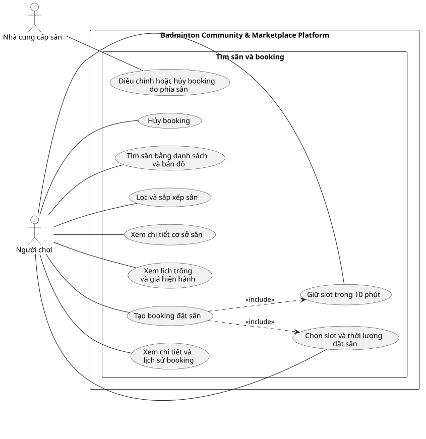

# Use Case Index - Tìm sân và booking

## Diagram

## Actors

| Actor | Loại | Mô tả | Nguồn |
|---|---|---|---|
| Người chơi | Primary | Tìm sân, xem lịch, giữ chỗ, tạo và quản lý booking. | ACT-01; F-BKG-01 đến F-BKG-11 |
| Nhà cung cấp sân | Primary | Điều chỉnh hoặc hủy booking do phía sân. | ACT-04; F-BKG-12 |

## Use cases

| Use Case ID | Slug | Tên Use Case | Actor chính | Actor phụ | Nguồn chức năng | Ưu tiên | Giai đoạn | Trạng thái | Updated |
|---|---|---|---|---|---|---|---:|---|---|
| UC-tim-san-danh-sach-ban-do | tim-san-danh-sach-ban-do | Tìm sân bằng danh sách và bản đồ | Người chơi | Không có | F-BKG-01 | P0 | 1 | Đã xác nhận | 2026-07-19 |
| UC-loc-sap-xep-san | loc-sap-xep-san | Lọc và sắp xếp sân | Người chơi | Không có | F-BKG-03 | P1 | 1 | Đã xác nhận | 2026-07-19 |
| UC-xem-chi-tiet-co-so-san | xem-chi-tiet-co-so-san | Xem chi tiết cơ sở sân | Người chơi | Không có | F-BKG-04 | P0 | 1 | Đã xác nhận | 2026-07-19 |
| UC-xem-lich-trong-va-gia | xem-lich-trong-va-gia | Xem lịch trống và giá hiện hành | Người chơi | Không có | F-BKG-02 | P0 | 1 | Đã xác nhận | 2026-07-19 |
| UC-chon-slot-va-thoi-luong | chon-slot-va-thoi-luong | Chọn slot và thời lượng đặt sân | Người chơi | Không có | F-BKG-05, F-BKG-07 | P0 | 1 | Đã xác nhận | 2026-07-19 |
| UC-giu-slot | giu-slot | Giữ slot trong 10 phút | Người chơi | Không có | F-BKG-06 | P0 | 1 | Đã xác nhận | 2026-07-19 |
| UC-tao-booking | tao-booking | Tạo booking đặt sân | Người chơi | Không có | F-BKG-08, F-BKG-09 | P0 | 1 | Đã xác nhận | 2026-07-19 |
| UC-xem-booking | xem-booking | Xem chi tiết và lịch sử booking | Người chơi | Không có | F-BKG-10 | P1 | 1 | Đã xác nhận | 2026-07-19 |
| UC-huy-booking | huy-booking | Hủy booking | Người chơi | Không có | F-BKG-11 | P0 | 1 | Đã xác nhận | 2026-07-19 |
| UC-dieu-chinh-booking-do-phia-san | dieu-chinh-booking-do-phia-san | Điều chỉnh hoặc hủy booking do phía sân | Nhà cung cấp sân | Người chơi | F-BKG-12 | P0 | 1 | Đã xác nhận | 2026-07-19 |

## Relationship evidence

| Type | From | To | Rationale | Có nên vẽ |
|---|---|---|---|---|
| include | UC-tao-booking | UC-giu-slot | Một booking trực tuyến chỉ được tạo khi slot đang được giữ hợp lệ. | Có |
| include | UC-tao-booking | UC-chon-slot-va-thoi-luong | Booking luôn cần một sân, thời gian và thời lượng hợp lệ. | Có |

## Cross-module dependencies

- `UC-tao-booking` chuyển sang thanh toán tại module Tài chính và tranh chấp; booking chỉ xác nhận khi thanh toán đủ 100%.
- Lịch trống lấy từ `UC-quan-ly-lich-san-hop-nhat` của module Nhà cung cấp và lịch sân.
- Thanh toán SePay đến sau khi hold hết hạn không làm sống lại booking cũ.
- Hủy booking gọi quy tắc hoàn tiền tương ứng trong module Tài chính và tranh chấp.

## Relationships

| Type | From | To | Rationale |
|---|---|---|---|
| association | Người chơi | UC-tim-san-danh-sach-ban-do | Tìm sân theo vị trí bằng danh sách và bản đồ. |
| association | Người chơi | UC-loc-sap-xep-san | Thu hẹp và sắp xếp kết quả tìm kiếm. |
| association | Người chơi | UC-xem-chi-tiet-co-so-san | Xem thông tin sân và tiện ích. |
| association | Người chơi | UC-xem-lich-trong-va-gia | Kiểm tra lịch trống và giá hiện hành. |
| association | Người chơi | UC-chon-slot-va-thoi-luong | Chọn thời gian và thời lượng hợp lệ. |
| association | Người chơi | UC-giu-slot | Giữ tạm slot trong 10 phút. |
| association | Người chơi | UC-tao-booking | Tạo booking đặt sân. |
| association | Người chơi | UC-xem-booking | Tra cứu chi tiết và lịch sử booking. |
| association | Người chơi | UC-huy-booking | Yêu cầu hủy booking. |
| association | Nhà cung cấp sân | UC-dieu-chinh-booking-do-phia-san | Điều chỉnh hoặc hủy booking do phía sân. |
| include | UC-tao-booking | UC-giu-slot | Booking chỉ được tạo khi slot đang được giữ hợp lệ. |
| include | UC-tao-booking | UC-chon-slot-va-thoi-luong | Booking luôn cần slot và thời lượng hợp lệ. |
