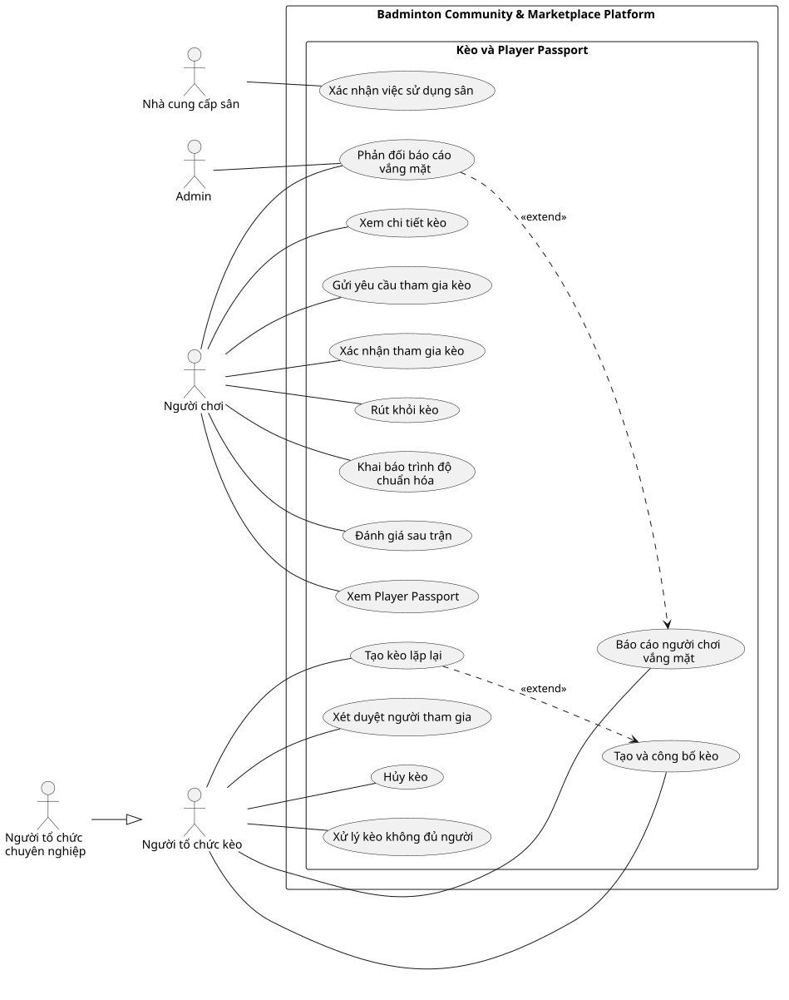

# Use Case Index - Kèo và Player Passport

## Diagram

## Actors

| Actor | Loại | Mô tả | Nguồn |
|---|---|---|---|
| Người chơi | Primary | Xem kèo, xin tham gia, rút khỏi kèo, khai báo trình độ và đánh giá sau trận. | ACT-01; F-MAT-06, F-MAT-09, F-MAT-14 đến F-MAT-17 |
| Người tổ chức kèo | Primary | Tạo và điều phối kèo, duyệt thành viên, hủy kèo và báo no-show. | ACT-02; F-MAT-01, F-MAT-03 đến F-MAT-05, F-MAT-07, F-MAT-10, F-MAT-13 |
| Người tổ chức chuyên nghiệp | Primary specialization | Người tổ chức đã được Admin xác minh để vận hành kèo thương mại. | ACT-03; quyết định về kèo thương mại |
| Nhà cung cấp sân | Secondary | Có thể xác nhận việc sử dụng sân bằng tên hoặc số điện thoại nhưng không bắt buộc. | ACT-04; F-MAT-12 |
| Admin | Secondary | Xử lý phản đối no-show và phê duyệt Người tổ chức chuyên nghiệp. | ACT-05; F-MAT-14, F-ADM-02, F-ADM-04 |

## Use cases

| Use Case ID | Slug | Tên Use Case | Actor chính | Actor phụ | Nguồn chức năng | Ưu tiên | Giai đoạn | Trạng thái | Updated |
|---|---|---|---|---|---|---|---:|---|---|
| UC-tao-va-cong-bo-keo | tao-va-cong-bo-keo | Tạo và công bố kèo | Người tổ chức kèo | Người tổ chức chuyên nghiệp | F-MAT-01 đến F-MAT-04 | P0 | 2 | Đã xác nhận | 2026-07-19 |
| UC-tao-keo-lap-lai | tao-keo-lap-lai | Tạo kèo lặp lại | Người tổ chức kèo | Người tổ chức chuyên nghiệp | F-MAT-05 | P2 | 3 | Giả định | 2026-07-19 |
| UC-xem-chi-tiet-keo | xem-chi-tiet-keo | Xem chi tiết kèo | Người chơi | Không có | F-MAT-02 đến F-MAT-04 | P0 | 2 | Đã xác nhận | 2026-07-19 |
| UC-gui-yeu-cau-tham-gia-keo | gui-yeu-cau-tham-gia-keo | Gửi yêu cầu tham gia kèo | Người chơi | Người tổ chức kèo | F-MAT-06 | P0 | 2 | Đã xác nhận | 2026-07-19 |
| UC-xet-duyet-nguoi-tham-gia | xet-duyet-nguoi-tham-gia | Xét duyệt người tham gia | Người tổ chức kèo | Người chơi, Người tổ chức chuyên nghiệp | F-MAT-07 | P0 | 2 | Đã xác nhận | 2026-07-19 |
| UC-xac-nhan-tham-gia-keo | xac-nhan-tham-gia-keo | Xác nhận tham gia kèo | Người chơi | Người tổ chức kèo | F-MAT-08 | P0 | 2 | Đã xác nhận | 2026-07-19 |
| UC-rut-khoi-keo | rut-khoi-keo | Rút khỏi kèo | Người chơi | Người tổ chức kèo | F-MAT-09 | P0 | 2 | Đã xác nhận | 2026-07-19 |
| UC-huy-keo | huy-keo | Hủy kèo | Người tổ chức kèo | Người chơi, Người tổ chức chuyên nghiệp | F-MAT-10 | P0 | 2 | Đã xác nhận | 2026-07-19 |
| UC-xu-ly-keo-khong-du-nguoi | xu-ly-keo-khong-du-nguoi | Xử lý kèo không đủ người | Người tổ chức kèo | Người chơi, Người tổ chức chuyên nghiệp | F-MAT-11 | P0 | 2 | Đã xác nhận | 2026-07-19 |
| UC-xac-nhan-su-dung-san | xac-nhan-su-dung-san | Xác nhận việc sử dụng sân | Nhà cung cấp sân | Người chơi | F-MAT-12 | P2 | 2 | Đã xác nhận | 2026-07-19 |
| UC-bao-cao-no-show | bao-cao-no-show | Báo cáo người chơi vắng mặt | Người tổ chức kèo | Người chơi, Người tổ chức chuyên nghiệp | F-MAT-13 | P0 | 2 | Đã xác nhận | 2026-07-19 |
| UC-phan-doi-no-show | phan-doi-no-show | Phản đối báo cáo vắng mặt | Người chơi | Admin | F-MAT-14 | P0 | 2 | Đã xác nhận | 2026-07-19 |
| UC-khai-bao-trinh-do | khai-bao-trinh-do | Khai báo trình độ chuẩn hóa | Người chơi | Không có | F-MAT-15 | P1 | 2 | Đã xác nhận | 2026-07-19 |
| UC-danh-gia-sau-tran | danh-gia-sau-tran | Đánh giá sau trận | Người chơi | Người tổ chức kèo | F-MAT-16 | P1 | 2 | Đã xác nhận | 2026-07-19 |
| UC-xem-player-passport | xem-player-passport | Xem Player Passport | Người chơi | Người tổ chức kèo | F-MAT-17 | P1 | 2 | Đã xác nhận | 2026-07-19 |

## Relationship evidence

| Type | From | To | Rationale | Có nên vẽ |
|---|---|---|---|---|
| generalization | Người tổ chức chuyên nghiệp | Người tổ chức kèo | Người tổ chức chuyên nghiệp là biến thể đã xác minh và kế thừa hành vi tổ chức kèo thông thường. | Có |
| extend | UC-tao-keo-lap-lai | UC-tao-va-cong-bo-keo | Lặp lại là lựa chọn bổ sung; kèo đơn vẫn hoàn chỉnh khi không dùng. | Có, nếu giữ UC giả định trên sơ đồ |
| extend | UC-phan-doi-no-show | UC-bao-cao-no-show | Phản đối chỉ phát sinh có điều kiện sau khi có báo cáo no-show; báo cáo vẫn có nghĩa nếu không bị phản đối. | Có |

## Cross-module dependencies

- Kèo liên kết booking nền tảng mang nhãn địa điểm đã xác thực; địa điểm ngoài hệ thống mang nhãn chưa xác thực.
- Sau khi host duyệt, kèo có phí chuyển sang `UC-thanh-toan-phi-keo`; kèo miễn phí xác nhận ngay.
- Host hủy hoặc kèo thiếu người dẫn đến hoàn toàn bộ; người tham gia rút theo chính sách; no-show không được hoàn.
- Chỉ báo cáo no-show không bị phản đối hoặc được Admin xác minh mới ảnh hưởng mức độ tin cậy.
- Xác nhận sử dụng sân là tùy chọn; không xác nhận vẫn không ngăn booking hoặc kèo hoàn thành.

## Relationships

| Type | From | To | Rationale |
|---|---|---|---|
| association | Người chơi | UC-xem-chi-tiet-keo | Xem thông tin và điều kiện của kèo. |
| association | Người chơi | UC-gui-yeu-cau-tham-gia-keo | Gửi yêu cầu tham gia. |
| association | Người chơi | UC-xac-nhan-tham-gia-keo | Hoàn tất xác nhận slot. |
| association | Người chơi | UC-rut-khoi-keo | Rút khỏi kèo theo chính sách. |
| association | Người chơi | UC-phan-doi-no-show | Phản đối báo cáo vắng mặt. |
| association | Người chơi | UC-khai-bao-trinh-do | Khai báo trình độ chuẩn hóa. |
| association | Người chơi | UC-danh-gia-sau-tran | Đánh giá trình độ và độ phù hợp. |
| association | Người chơi | UC-xem-player-passport | Xem lịch sử và mức độ tin cậy. |
| association | Người tổ chức kèo | UC-tao-va-cong-bo-keo | Tạo và công bố kèo tuyển người. |
| association | Người tổ chức kèo | UC-tao-keo-lap-lai | Tạo lịch kèo lặp lại. |
| association | Người tổ chức kèo | UC-xet-duyet-nguoi-tham-gia | Duyệt hoặc từ chối yêu cầu tham gia. |
| association | Người tổ chức kèo | UC-huy-keo | Hủy kèo và thông báo thành viên. |
| association | Người tổ chức kèo | UC-xu-ly-keo-khong-du-nguoi | Xử lý kèo thiếu người. |
| association | Người tổ chức kèo | UC-bao-cao-no-show | Báo cáo thành viên vắng mặt. |
| association | Nhà cung cấp sân | UC-xac-nhan-su-dung-san | Xác nhận tùy chọn việc sử dụng sân. |
| association | Admin | UC-phan-doi-no-show | Xem bằng chứng và xử lý phản đối. |
| generalization | Người tổ chức chuyên nghiệp | Người tổ chức kèo | Vai trò chuyên nghiệp kế thừa hành vi tổ chức kèo. |
| extend | UC-tao-keo-lap-lai | UC-tao-va-cong-bo-keo | Lặp lại là lựa chọn bổ sung cho kèo đơn. |
| extend | UC-phan-doi-no-show | UC-bao-cao-no-show | Phản đối chỉ phát sinh sau báo cáo no-show. |
