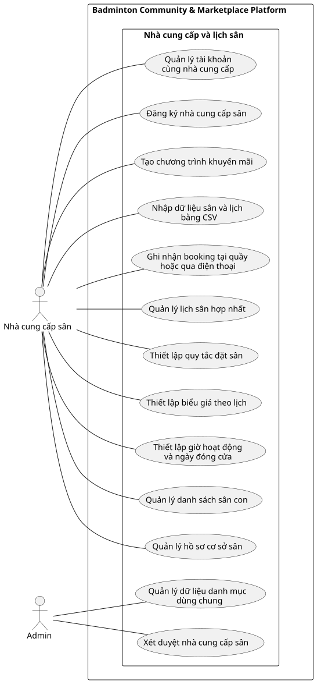

# Use Case Index - Nhà cung cấp và lịch sân

## Diagram

## Actors

| Actor | Loại | Mô tả | Nguồn |
|---|---|---|---|
| Nhà cung cấp sân | Primary | Đăng ký, cấu hình cơ sở, sân, lịch, giá và booking nội bộ. | ACT-04; F-VEN-01, F-VEN-03 đến F-VEN-12 |
| Admin | Primary | Phê duyệt nhà cung cấp và quản lý dữ liệu danh mục dùng chung. | ACT-05; F-VEN-02, F-ADM-03 |

## Use cases

| Use Case ID | Slug | Tên Use Case | Actor chính | Actor phụ | Nguồn chức năng | Ưu tiên | Giai đoạn | Trạng thái | Updated |
|---|---|---|---|---|---|---|---:|---|---|
| UC-dang-ky-nha-cung-cap | dang-ky-nha-cung-cap | Đăng ký nhà cung cấp sân | Nhà cung cấp sân | Admin | F-VEN-01 | P0 | 1 | Đã xác nhận | 2026-07-19 |
| UC-xet-duyet-nha-cung-cap | xet-duyet-nha-cung-cap | Xét duyệt nhà cung cấp sân | Admin | Nhà cung cấp sân | F-VEN-02 | P0 | 1 | Đã xác nhận | 2026-07-19 |
| UC-quan-ly-tai-khoan-nha-cung-cap | quan-ly-tai-khoan-nha-cung-cap | Quản lý tài khoản cùng nhà cung cấp | Nhà cung cấp sân | Admin | F-VEN-03 | P1 | 1 | Đã xác nhận | 2026-07-19 |
| UC-quan-ly-co-so-san | quan-ly-co-so-san | Quản lý hồ sơ cơ sở sân | Nhà cung cấp sân | Không có | F-VEN-04 | P0 | 1 | Đã xác nhận | 2026-07-19 |
| UC-quan-ly-san-con | quan-ly-san-con | Quản lý danh sách sân con | Nhà cung cấp sân | Không có | F-VEN-05 | P0 | 1 | Đã xác nhận | 2026-07-19 |
| UC-thiet-lap-gio-hoat-dong | thiet-lap-gio-hoat-dong | Thiết lập giờ hoạt động và ngày đóng cửa | Nhà cung cấp sân | Không có | F-VEN-06 | P0 | 1 | Đã xác nhận | 2026-07-19 |
| UC-thiet-lap-bieu-gia | thiet-lap-bieu-gia | Thiết lập biểu giá theo lịch | Nhà cung cấp sân | Không có | F-VEN-07 | P0 | 1 | Đã xác nhận | 2026-07-19 |
| UC-thiet-lap-quy-tac-dat-san | thiet-lap-quy-tac-dat-san | Thiết lập quy tắc đặt sân | Nhà cung cấp sân | Không có | F-VEN-08 | P0 | 1 | Đã xác nhận | 2026-07-19 |
| UC-quan-ly-lich-san-hop-nhat | quan-ly-lich-san-hop-nhat | Quản lý lịch sân hợp nhất | Nhà cung cấp sân | Không có | F-VEN-09 | P0 | 1 | Đã xác nhận | 2026-07-19 |
| UC-ghi-nhan-booking-noi-bo | ghi-nhan-booking-noi-bo | Ghi nhận booking tại quầy hoặc qua điện thoại | Nhà cung cấp sân | Không có | F-VEN-10 | P0 | 1 | Đã xác nhận | 2026-07-19 |
| UC-nhap-du-lieu-csv | nhap-du-lieu-csv | Nhập dữ liệu sân và lịch bằng CSV | Nhà cung cấp sân | Không có | F-VEN-12 | P1 | 1 | Đã xác nhận | 2026-07-19 |
| UC-tao-khuyen-mai | tao-khuyen-mai | Tạo chương trình khuyến mãi | Nhà cung cấp sân | Không có | F-VEN-11 | P2 | 3 | Giả định | 2026-07-19 |
| UC-quan-ly-danh-muc-dung-chung | quan-ly-danh-muc-dung-chung | Quản lý dữ liệu danh mục dùng chung | Admin | Không có | F-ADM-03 | P2 | 1 | Giả định | 2026-07-19 |

## Relationship evidence

Không có quan hệ `include`, `extend` hoặc `generalization` đủ bằng chứng để vẽ. Các điều kiện như nhà cung cấp phải được duyệt trước khi quản lý sân là phụ thuộc trạng thái giữa các phiên, không phải `include`.

## Cross-module dependencies

- Lịch sân hợp nhất là nguồn dữ liệu cho module Tìm sân và booking.
- Booking tại quầy hoặc qua điện thoại phải chiếm slot giống booking trực tuyến.
- Biểu giá và quy tắc đặt sân là đầu vào bắt buộc khi kiểm tra giá và thời lượng booking.
- Không yêu cầu bằng chứng sở hữu hoặc quyền quản lý sân; hồ sơ cần thông tin liên hệ và tài khoản ngân hàng nhận tiền.

## Relationships

| Type | From | To | Rationale |
|---|---|---|---|
| association | Nhà cung cấp sân | UC-dang-ky-nha-cung-cap | Gửi hồ sơ tham gia marketplace. |
| association | Nhà cung cấp sân | UC-quan-ly-tai-khoan-nha-cung-cap | Quản lý các tài khoản cùng đơn vị. |
| association | Nhà cung cấp sân | UC-quan-ly-co-so-san | Quản lý thông tin cơ sở sân. |
| association | Nhà cung cấp sân | UC-quan-ly-san-con | Quản lý danh sách sân con. |
| association | Nhà cung cấp sân | UC-thiet-lap-gio-hoat-dong | Cấu hình giờ hoạt động và ngày đóng cửa. |
| association | Nhà cung cấp sân | UC-thiet-lap-bieu-gia | Cấu hình giá theo lịch. |
| association | Nhà cung cấp sân | UC-thiet-lap-quy-tac-dat-san | Cấu hình khoảng đặt và giới hạn thời lượng. |
| association | Nhà cung cấp sân | UC-quan-ly-lich-san-hop-nhat | Duy trì nguồn lịch sân chính thức. |
| association | Nhà cung cấp sân | UC-ghi-nhan-booking-noi-bo | Ghi booking tại quầy hoặc qua điện thoại. |
| association | Nhà cung cấp sân | UC-nhap-du-lieu-csv | Nhập sân, giá và lịch từ CSV. |
| association | Nhà cung cấp sân | UC-tao-khuyen-mai | Tạo chương trình khuyến mãi giai đoạn 3. |
| association | Admin | UC-xet-duyet-nha-cung-cap | Phê duyệt hoặc từ chối hồ sơ nhà cung cấp. |
| association | Admin | UC-quan-ly-danh-muc-dung-chung | Quản lý danh mục dùng chung của nền tảng. |
