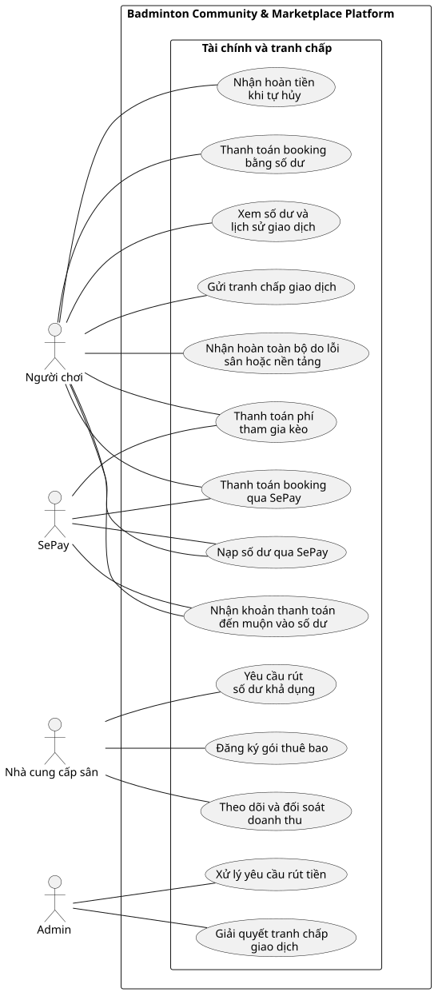

# Use Case Index - Tài chính và tranh chấp

## Diagram

## Actors

| Actor | Loại | Mô tả | Nguồn |
|---|---|---|---|
| Người chơi | Primary | Nạp số dư, thanh toán, nhận hoàn tiền và gửi tranh chấp. | ACT-01; F-FIN-01 đến F-FIN-08 |
| Nhà cung cấp sân | Primary | Theo dõi doanh thu, hoa hồng và yêu cầu rút tiền. | ACT-04; F-FIN-09 đến F-FIN-12, F-FIN-14 |
| Admin | Primary | Xử lý rút tiền, tranh chấp, hoàn tiền và giám sát tài chính. | ACT-05; F-FIN-13, F-ADM-04, F-ADM-05 |
| SePay | System | Cung cấp kết quả thanh toán hoặc nạp số dư. | ACT-06; F-FIN-02, F-FIN-04, F-FIN-06 |

## Use cases

| Use Case ID | Slug | Tên Use Case | Actor chính | Actor phụ | Nguồn chức năng | Ưu tiên | Giai đoạn | Trạng thái | Updated |
|---|---|---|---|---|---|---|---:|---|---|
| UC-xem-so-du-va-giao-dich | xem-so-du-va-giao-dich | Xem số dư và lịch sử giao dịch | Người chơi | Không có | F-FIN-01 | P0 | 1 | Đã xác nhận | 2026-07-19 |
| UC-nap-so-du-qua-sepay | nap-so-du-qua-sepay | Nạp số dư qua SePay | Người chơi | SePay | F-FIN-02 | P0 | 1 | Đã xác nhận | 2026-07-19 |
| UC-thanh-toan-booking-bang-so-du | thanh-toan-booking-bang-so-du | Thanh toán booking bằng số dư | Người chơi | Không có | F-FIN-03 | P0 | 1 | Đã xác nhận | 2026-07-19 |
| UC-thanh-toan-booking-qua-sepay | thanh-toan-booking-qua-sepay | Thanh toán booking qua SePay | Người chơi | SePay | F-FIN-04 | P0 | 1 | Đã xác nhận | 2026-07-19 |
| UC-thanh-toan-phi-keo | thanh-toan-phi-keo | Thanh toán phí tham gia kèo | Người chơi | SePay | F-FIN-05 | P0 | 2 | Đã xác nhận | 2026-07-19 |
| UC-nhan-khoan-thanh-toan-den-muon | nhan-khoan-thanh-toan-den-muon | Nhận khoản thanh toán đến muộn vào số dư | Người chơi | SePay | F-FIN-06 | P0 | 1 | Đã xác nhận | 2026-07-19 |
| UC-nhan-hoan-tien-khi-tu-huy | nhan-hoan-tien-khi-tu-huy | Nhận hoàn tiền khi tự hủy | Người chơi | Không có | F-FIN-08 | P0 | 1 | Đã xác nhận | 2026-07-19 |
| UC-nhan-hoan-tien-do-loi-he-thong | nhan-hoan-tien-do-loi-he-thong | Nhận hoàn toàn bộ do lỗi sân hoặc nền tảng | Người chơi | Admin | F-FIN-07 | P0 | 1 | Đã xác nhận | 2026-07-19 |
| UC-theo-doi-va-doi-soat-doanh-thu | theo-doi-va-doi-soat-doanh-thu | Theo dõi và đối soát doanh thu | Nhà cung cấp sân | Admin | F-FIN-09 đến F-FIN-11, F-ADM-05 | P0 | 1 | Đã xác nhận | 2026-07-19 |
| UC-yeu-cau-rut-tien | yeu-cau-rut-tien | Yêu cầu rút số dư khả dụng | Nhà cung cấp sân | Admin | F-FIN-12 | P0 | 1 | Đã xác nhận | 2026-07-19 |
| UC-xu-ly-yeu-cau-rut-tien | xu-ly-yeu-cau-rut-tien | Xử lý yêu cầu rút tiền | Admin | Nhà cung cấp sân | F-FIN-13 | P0 | 1 | Đã xác nhận | 2026-07-19 |
| UC-gui-tranh-chap-giao-dich | gui-tranh-chap-giao-dich | Gửi tranh chấp giao dịch | Người chơi | Nhà cung cấp sân, Admin | F-ADM-04 | P0 | 1 | Đã xác nhận | 2026-07-19 |
| UC-giai-quyet-tranh-chap-giao-dich | giai-quyet-tranh-chap-giao-dich | Giải quyết tranh chấp giao dịch | Admin | Người chơi, Nhà cung cấp sân | F-ADM-04 | P0 | 1 | Đã xác nhận | 2026-07-19 |
| UC-dang-ky-goi-thue-bao | dang-ky-goi-thue-bao | Đăng ký gói thuê bao | Nhà cung cấp sân | Admin | F-FIN-14 | P2 | 3 | Đã xác nhận | 2026-07-19 |

## Relationship evidence

Không vẽ `include` giữa booking và các phương thức thanh toán vì chúng thuộc các nhánh thay thế loại trừ nhau. Không vẽ `extend` cho tranh chấp vì tranh chấp là mục tiêu độc lập phát sinh sau giao dịch, không phải bước chèn vào một Use Case đang chạy.

## Cross-module dependencies

- Hai UC thanh toán booking chỉ chạy khi module Tìm sân và booking còn hold hợp lệ.
- `UC-thanh-toan-phi-keo` được gọi sau khi host duyệt yêu cầu tham gia; kèo miễn phí không gọi UC này.
- Doanh thu chỉ chuyển sang khả dụng sau khi sân hoặc kèo kết thúc và hết 24 giờ khiếu nại.
- No-show không được hoàn tiền; hủy do người tổ chức hoặc kèo thiếu người được hoàn toàn bộ.
- Hoa hồng được đảo hoặc tính lại trên phần doanh thu thực sự được giữ lại sau hoàn tiền.

## Relationships

| Type | From | To | Rationale |
|---|---|---|---|
| association | Người chơi | UC-xem-so-du-va-giao-dich | Theo dõi số dư và lịch sử giao dịch. |
| association | Người chơi | UC-nap-so-du-qua-sepay | Nạp tiền vào số dư hệ thống. |
| association | Người chơi | UC-thanh-toan-booking-bang-so-du | Thanh toán booking từ số dư. |
| association | Người chơi | UC-thanh-toan-booking-qua-sepay | Thanh toán booking qua SePay. |
| association | Người chơi | UC-thanh-toan-phi-keo | Thanh toán phí tham gia kèo. |
| association | Người chơi | UC-nhan-khoan-thanh-toan-den-muon | Nhận khoản đến muộn vào số dư. |
| association | Người chơi | UC-nhan-hoan-tien-khi-tu-huy | Nhận hoàn tiền theo chính sách hủy. |
| association | Người chơi | UC-nhan-hoan-tien-do-loi-he-thong | Nhận hoàn toàn bộ khi lỗi thuộc sân hoặc nền tảng. |
| association | Người chơi | UC-gui-tranh-chap-giao-dich | Gửi yêu cầu giải quyết tranh chấp. |
| association | Nhà cung cấp sân | UC-theo-doi-va-doi-soat-doanh-thu | Theo dõi hoa hồng và doanh thu khả dụng. |
| association | Nhà cung cấp sân | UC-yeu-cau-rut-tien | Yêu cầu rút số dư khả dụng. |
| association | Nhà cung cấp sân | UC-dang-ky-goi-thue-bao | Đăng ký gói thuê bao giai đoạn 3. |
| association | Admin | UC-xu-ly-yeu-cau-rut-tien | Phê duyệt hoặc từ chối yêu cầu rút. |
| association | Admin | UC-giai-quyet-tranh-chap-giao-dich | Xem bằng chứng và quyết định tranh chấp. |
| association | SePay | UC-nap-so-du-qua-sepay | Cung cấp kết quả giao dịch nạp tiền. |
| association | SePay | UC-thanh-toan-booking-qua-sepay | Cung cấp kết quả thanh toán booking. |
| association | SePay | UC-thanh-toan-phi-keo | Cung cấp kết quả thanh toán phí kèo. |
| association | SePay | UC-nhan-khoan-thanh-toan-den-muon | Thông báo khoản thanh toán đến sau hold. |
